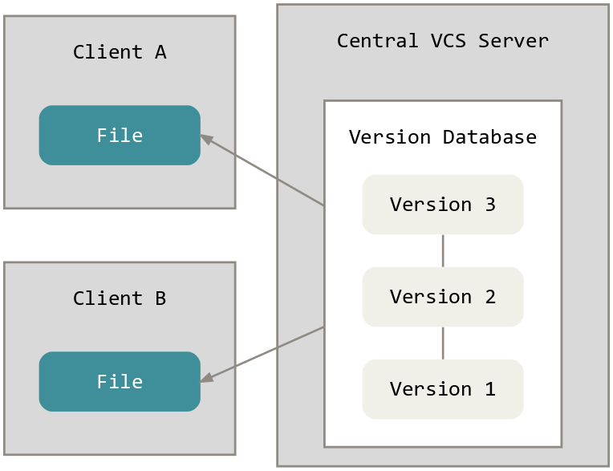
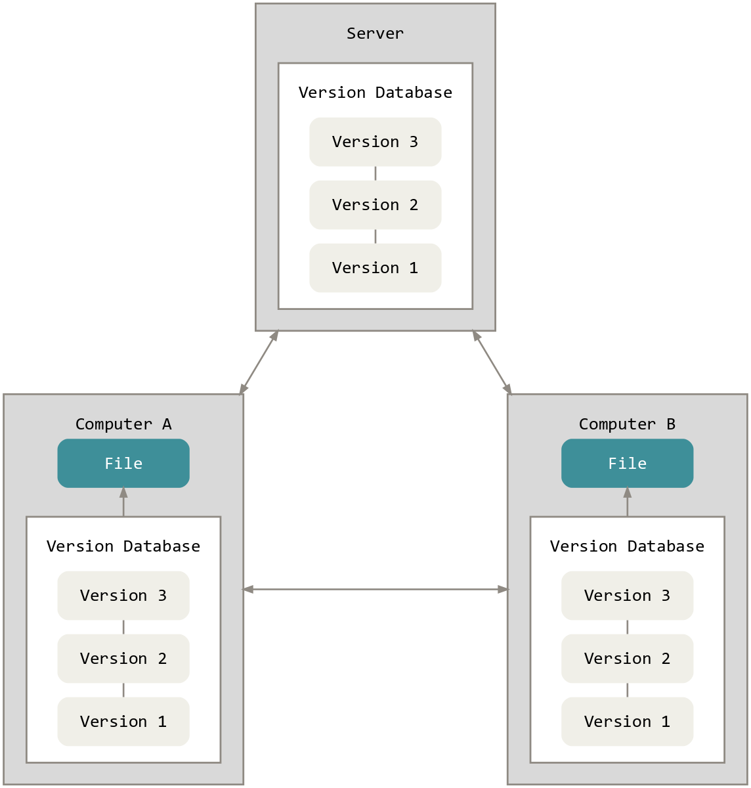

# Basics

Commit often, perfect later, publish once

## Comparison to other version control systems

Classical version control systems have one central repository that is accessed by all participants.



Each participant checks out a working copy from the central repository. Changes are committed to the central repository directly.

With Git every participant has its own full repository with all version information on his own machine.



This causes some advantages:

- There is no need to be connected to some central repository while working
- A participant can make commits, branches and can even change the version history on his local machine before he publishes his changes
- If a centralized VC repository gets lost you have better a backup. With Git and other decentralized VCSs every participant has a backup
- ...

## Working with Git

There are several graphical tools available that make it more or less easier to work with Git. But it is recommended to use the CLI to learn the basics. Many users prefer the CLI actually. One graphical Git tool that can be recommended is [Git Extensions](https://gitextensions.github.io/).

### First steps

Make sure that you have the command `git` in your system PATH. The `git` command should be available after you installed [Git Extensions](https://gitextensions.github.io/). If there are problems or you want use only Git and nothing else you can get Git directly from its [Website](https://git-scm.com/).

Basic command syntax:

```
$ git <verb>
```

Get help:

```
$ git help <verb>
$ git <verb> --help
```

#### Create a new repository

```
PS D:\test\repo> git init
Initialized empty Git repository in D:/test/repo/.git/
```

##### With Git Extensions

Step1:


Step 2:


Step 3:


After that you can open the Git Extensions main window.

1:


2:


#### Add first file to repository

Add some text file to your repository directory (in this example the file is named "hello.txt" ).

Typing `git status` now will give you this output:

```
PS D:\test\repo> git status
On branch master

Initial commit

Untracked files:
  (use "git add <file>..." to include in what will be committed)

        hello.txt

nothing added to commit but untracked files present (use "git add" to track)
```

In Git Extensions you see this:


"Untracked" means that the file is not part of the repository yet. To add the file to the repository:

```
PS D:\test\repo> git add hello.txt
```

Alternatively you can type `git add .` but you should learn to use the ".gitignore" file before using this command.

To make a commit:

```
PS D:\test\repo> git commit -m "My first commit"
[master (root-commit) 15cc061] My first commit
 1 file changed, 1 insertion(+)
 create mode 100644 hello.txt
```

The repository contains now exactly one commit. Typing `git status` will give you this output now:

```
PS D:\test\repo> git commit -m "My first commit"
[master (root-commit) 15cc061] My first commit
 1 file changed, 1 insertion(+)
 create mode 100644 hello.txt
```

##### With Git Extensions

Step 1: Click on this button:


A window will open:


Step 2: Click on the button "Stage":


As seen in the image above, the file to add should be in the bottom part of the window now.

Step 3: Add a commit message and click on the button "Commit".


After confirming the message window, the Git Extensions main window should look like this:


#### Modify a file

A `git status` after a file is modified will look like this:

```
PS D:\test\repo> git status
On branch master
Changes not staged for commit:
  (use "git add <file>..." to update what will be committed)
  (use "git checkout -- <file>..." to discard changes in working directory)

        modified:   hello.txt

no changes added to commit (use "git add" and/or "git commit -a")
```

Note that Git does say nothing about "untracked" but something about "Changes not staged". It is a difference whether a file is unknown in the repository yet or a known file has modifications. The actions have to be done are similar to adding new files to the repository.

First, "stage" the file:

```
PS D:\test\repo> git add hello.txt
```

A `git status` will show that the file is ready to be committed as "modified". The actual commit is also very similar:

```
PS D:\test\repo> git commit -m "Modify a file"
[master 38b223d] Modify a file
 1 file changed, 1 insertion(+), 1 deletion(-)
```

##### With Git Extensions

Much like as the CLI, committing a modified file is very similar to committing a new file. See the description of committing a new file above.

#### Add a .gitignore file

You should add a file named `.gitignore` in the root directory of your project at the very beginning - ideally with the first commit. Git Extensions offers a template that covers all usual Visual Studio and Windows junk. Feel free to add additional patterns. In practice it makes less problems to not commit a file that should be committed as the other way around.

The ".gitignore" template of Git Extensions version 2.50.02

```
#Ignore thumbnails created by Windows
Thumbs.db

#Ignore files built by Visual Studio
*.user
*.aps
*.pch
*.vspscc
*_i.c
*_p.c
*.ncb
*.suo
*.bak
*.cache
*.ilk
*.log
[Bb]in
[Dd]ebug*/
*.sbr
obj/
[Rr]elease*/
_ReSharper*/

# Added by author
.vs/
```

## Some technical background

### About repositories

A personal Git repository is nothing more then a directory that contains a subdirectory named ".git" and with certain content. This subdirectory contains all the information about the repository.

# Branching

# Merging

# Rebase

# Working with central repositories

# Workflows

## Practice

# Sources

[Git workshop of Alexander Groß](https://github.com/agross/git-reveal)