Commit often, perfect later, publish once

# Basics

## Comparison to other version control systems

Classical version control systems have one central repository that is accessed by all participants.


Each participant checks out a working copy from the central repository. Changes are committed to the central repository directly.

With Git every participant has its own full repository with all version information on his own machine.


This causes some advantages:

- There is no need to be connected to some central repository while working
- A participant can make commits, branches and can even change the version history on his local machine without disturbing anyone before he publishes his changes
- If a centralized VC repository gets lost you have better a backup. With Git and other decentralized VCSs every participant has a backup
- There is no need to have any server instance running just to track a revision history
- Performance is much better because most operations do not depend on a network connection

## Working with Git

There are several graphical tools available that make it more or less easier to work with Git. But it is recommended to use the CLI to learn the basics. Many users prefer the CLI actually. One graphical Git tool that can be recommended is [Git Extensions](https://gitextensions.github.io/).

### Basic principles

Working with Git is much more easy and pleasant if you know some principles:

- All operations are done on the "current" branch (the branch that was checked out the last time).
- Most operations should be done with a clean working directory. This means that there should be no modifications since the last commit.
- As long as you did not publish your commits to a central one, you can change almost all of them. You can even change the order of the commits, split a commit or combine them (these are so called "rebase" operations). But do not such things on published commits if there is not a *very* good reason for that and even then you must discuss this with all people that work on the repository. If you do not follow this advice you and/or your colleagues will be irritated very much and you could be hated by all of them.

#### Lifecycle of a file


If you create a file, it is first in the state "untracked". A commit will only persist files that are in the state "staged", meaning they are added to the "staging area" (synonym: "index"). Because of this, they must be "added" to the staging area.

If you modify a file that is tracked already (no matter whether it is staged only or already part of a commit), it gets the state "modified". Though a "modified" file has to be added by the same command `git add` too, it is different to the "untracked" state - e.g. the `.gitignore` file will only affect files that are "untracked" yet.

If you make a commit, the "staged" files get the state "unmodified". "Unmodified" files are not considered for the next commit. If an "unmodified" file gets "modified" it has to be added to the staging area again before the next commit is done (as long as the next commit shall contain these changes).

### First steps

Make sure that you have the command `git` in your system PATH. The `git` command should be available after you installed [Git Extensions](https://gitextensions.github.io/). If there are problems or you want use only Git and nothing else you can get Git directly from its [Website](https://git-scm.com/).

Basic command syntax:

```
$ git <verb>
```

Get help:

```
$ git help <verb>
$ git <verb> --help
```

#### Create a new repository

```
$ git init
Initialized empty Git repository in D:/test/repo/.git/
```

##### With Git Extensions

Step1:

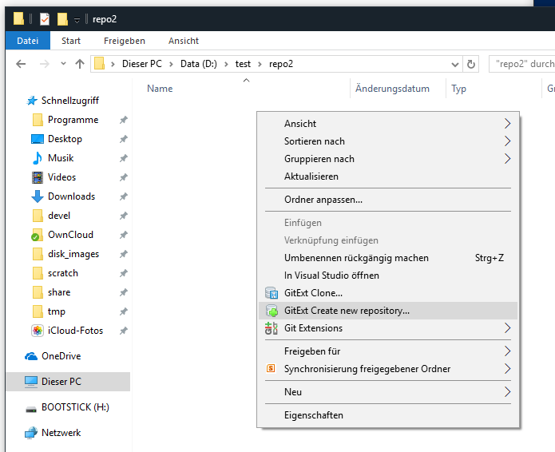

Step 2:


Step 3:

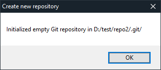

After that you can open the Git Extensions main window.

1:

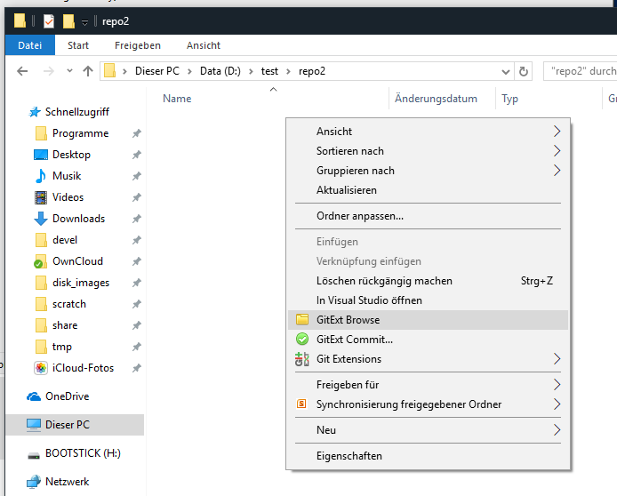

2:

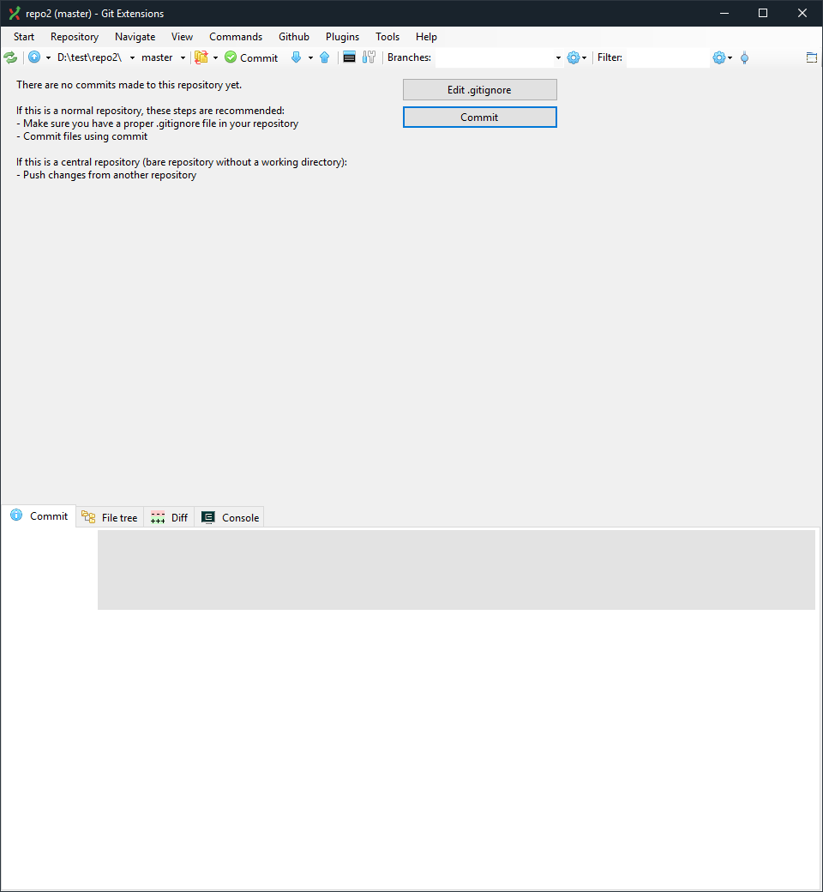

#### Add first file to repository

Add some text file to your repository directory (in this example the file is named "hello.txt" ).

Typing `git status` now will give you this output:

```
$ git status
On branch master

Initial commit

Untracked files:
  (use "git add <file>..." to include in what will be committed)

        hello.txt

nothing added to commit but untracked files present (use "git add" to track)
```

In Git Extensions you see this:

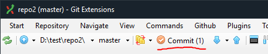

"Untracked" means that the file is not part of the repository yet. To add the file to the repository:

```
$ git add hello.txt
```

Alternatively you can type `git add .` but you should learn to use the ".gitignore" file before using this command.

To make a commit:

```
$ git commit -m "My first commit"
[master (root-commit) 15cc061] My first commit
 1 file changed, 1 insertion(+)
 create mode 100644 hello.txt
```

The repository contains now exactly one commit. Typing `git status` will give you this output now:

```
$ git commit -m "My first commit"
[master (root-commit) 15cc061] My first commit
 1 file changed, 1 insertion(+)
 create mode 100644 hello.txt
```

##### With Git Extensions

Step 1: Click on this button:


A window will open:

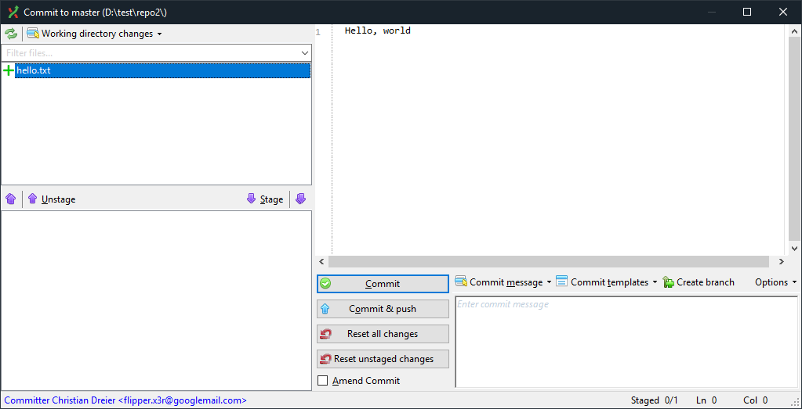

Step 2: Click on the button "Stage":

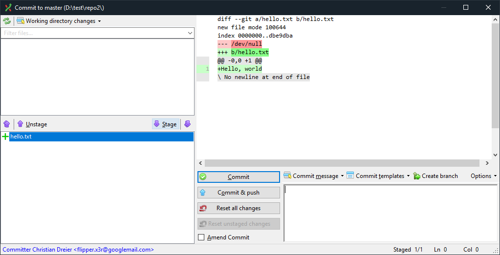

As seen in the image above, the file to add should be in the bottom part of the window now.

Step 3: Add a commit message and click on the button "Commit".

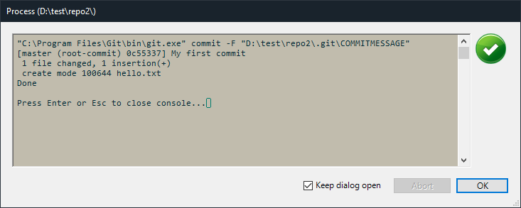

After confirming the message window, the Git Extensions main window should look like this:

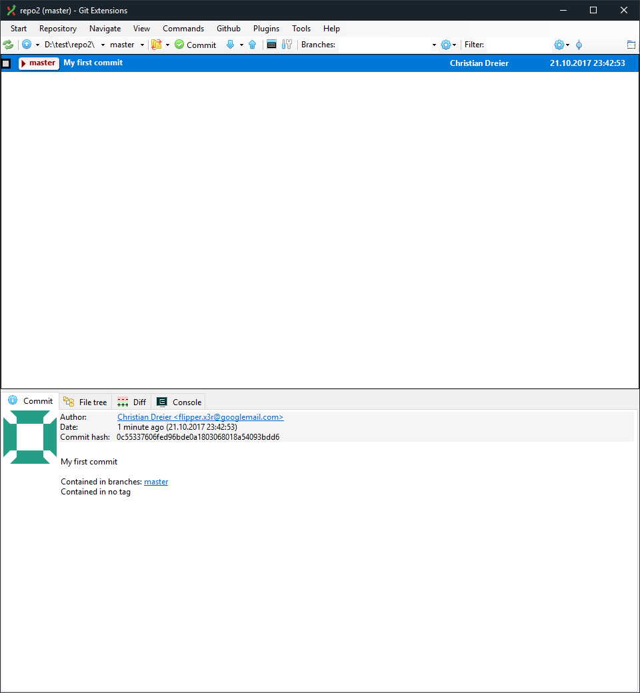

#### Modify a file

A `git status` after a file is modified will look like this:

```
$ git status
On branch master
Changes not staged for commit:
  (use "git add <file>..." to update what will be committed)
  (use "git checkout -- <file>..." to discard changes in working directory)

        modified:   hello.txt

no changes added to commit (use "git add" and/or "git commit -a")
```

Note that Git does say nothing about "untracked" but something about "Changes not staged". It is a difference whether a file is unknown in the repository yet or a known file has modifications. The actions have to be done are similar to adding new files to the repository.

First, "stage" the file:

```
$ git add hello.txt
```

A `git status` will show that the file is ready to be committed as "modified". The actual commit is also very similar:

```
$ git commit -m "Modify a file"
[master 38b223d] Modify a file
 1 file changed, 1 insertion(+), 1 deletion(-)
```

##### With Git Extensions

Much like as the CLI, committing a modified file is very similar to committing a new file. See the description of committing a new file above.

#### Add a .gitignore file

You should add a file named `.gitignore` in the root directory of your project at the very beginning - ideally with the first commit. On [GitHub](https://github.com/github/gitignore) is a large collection of .gitignore templates. These templates cover almost all junk files that can be generated by certain development environments.

This is the ".gitignore" template for Visual Studio:

```
## Ignore Visual Studio temporary files, build results, and
## files generated by popular Visual Studio add-ons.
##
## Get latest from https://github.com/github/gitignore/blob/master/VisualStudio.gitignore

# User-specific files
*.suo
*.user
*.userosscache
*.sln.docstates

# User-specific files (MonoDevelop/Xamarin Studio)
*.userprefs

# Build results
[Dd]ebug/
[Dd]ebugPublic/
[Rr]elease/
[Rr]eleases/
x64/
x86/
bld/
[Bb]in/
[Oo]bj/
[Ll]og/

# Visual Studio 2015 cache/options directory
.vs/
# Uncomment if you have tasks that create the project's static files in wwwroot
#wwwroot/

# MSTest test Results
[Tt]est[Rr]esult*/
[Bb]uild[Ll]og.*

# NUNIT
*.VisualState.xml
TestResult.xml

# Build Results of an ATL Project
[Dd]ebugPS/
[Rr]eleasePS/
dlldata.c

# Benchmark Results
BenchmarkDotNet.Artifacts/

# .NET Core
project.lock.json
project.fragment.lock.json
artifacts/
**/Properties/launchSettings.json

*_i.c
*_p.c
*_i.h
*.ilk
*.meta
*.obj
*.pch
*.pdb
*.pgc
*.pgd
*.rsp
*.sbr
*.tlb
*.tli
*.tlh
*.tmp
*.tmp_proj
*.log
*.vspscc
*.vssscc
.builds
*.pidb
*.svclog
*.scc

# Chutzpah Test files
_Chutzpah*

# Visual C++ cache files
ipch/
*.aps
*.ncb
*.opendb
*.opensdf
*.sdf
*.cachefile
*.VC.db
*.VC.VC.opendb

# Visual Studio profiler
*.psess
*.vsp
*.vspx
*.sap

# Visual Studio Trace Files
*.e2e

# TFS 2012 Local Workspace
$tf/

# Guidance Automation Toolkit
*.gpState

# ReSharper is a .NET coding add-in
_ReSharper*/
*.[Rr]e[Ss]harper
*.DotSettings.user

# JustCode is a .NET coding add-in
.JustCode

# TeamCity is a build add-in
_TeamCity*

# DotCover is a Code Coverage Tool
*.dotCover

# AxoCover is a Code Coverage Tool
.axoCover/*
!.axoCover/settings.json

# Visual Studio code coverage results
*.coverage
*.coveragexml

# NCrunch
_NCrunch_*
.*crunch*.local.xml
nCrunchTemp_*

# MightyMoose
*.mm.*
AutoTest.Net/

# Web workbench (sass)
.sass-cache/

# Installshield output folder
[Ee]xpress/

# DocProject is a documentation generator add-in
DocProject/buildhelp/
DocProject/Help/*.HxT
DocProject/Help/*.HxC
DocProject/Help/*.hhc
DocProject/Help/*.hhk
DocProject/Help/*.hhp
DocProject/Help/Html2
DocProject/Help/html

# Click-Once directory
publish/

# Publish Web Output
*.[Pp]ublish.xml
*.azurePubxml
# Note: Comment the next line if you want to checkin your web deploy settings,
# but database connection strings (with potential passwords) will be unencrypted
*.pubxml
*.publishproj

# Microsoft Azure Web App publish settings. Comment the next line if you want to
# checkin your Azure Web App publish settings, but sensitive information contained
# in these scripts will be unencrypted
PublishScripts/

# NuGet Packages
*.nupkg
# The packages folder can be ignored because of Package Restore
**/[Pp]ackages/*
# except build/, which is used as an MSBuild target.
!**/[Pp]ackages/build/
# Uncomment if necessary however generally it will be regenerated when needed
#!**/[Pp]ackages/repositories.config
# NuGet v3's project.json files produces more ignorable files
*.nuget.props
*.nuget.targets

# Microsoft Azure Build Output
csx/
*.build.csdef

# Microsoft Azure Emulator
ecf/
rcf/

# Windows Store app package directories and files
AppPackages/
BundleArtifacts/
Package.StoreAssociation.xml
_pkginfo.txt
*.appx

# Visual Studio cache files
# files ending in .cache can be ignored
*.[Cc]ache
# but keep track of directories ending in .cache
!*.[Cc]ache/

# Others
ClientBin/
~$*
*~
*.dbmdl
*.dbproj.schemaview
*.jfm
*.pfx
*.publishsettings
orleans.codegen.cs

# Since there are multiple workflows, uncomment next line to ignore bower_components
# (https://github.com/github/gitignore/pull/1529#issuecomment-104372622)
#bower_components/

# RIA/Silverlight projects
Generated_Code/

# Backup & report files from converting an old project file
# to a newer Visual Studio version. Backup files are not needed,
# because we have git ;-)
_UpgradeReport_Files/
Backup*/
UpgradeLog*.XML
UpgradeLog*.htm

# SQL Server files
*.mdf
*.ldf
*.ndf

# Business Intelligence projects
*.rdl.data
*.bim.layout
*.bim_*.settings

# Microsoft Fakes
FakesAssemblies/

# GhostDoc plugin setting file
*.GhostDoc.xml

# Node.js Tools for Visual Studio
.ntvs_analysis.dat
node_modules/

# Typescript v1 declaration files
typings/

# Visual Studio 6 build log
*.plg

# Visual Studio 6 workspace options file
*.opt

# Visual Studio 6 auto-generated workspace file (contains which files were open etc.)
*.vbw

# Visual Studio LightSwitch build output
**/*.HTMLClient/GeneratedArtifacts
**/*.DesktopClient/GeneratedArtifacts
**/*.DesktopClient/ModelManifest.xml
**/*.Server/GeneratedArtifacts
**/*.Server/ModelManifest.xml
_Pvt_Extensions

# Paket dependency manager
.paket/paket.exe
paket-files/

# FAKE - F# Make
.fake/

# JetBrains Rider
.idea/
*.sln.iml

# CodeRush
.cr/

# Python Tools for Visual Studio (PTVS)
__pycache__/
*.pyc

# Cake - Uncomment if you are using it
# tools/**
# !tools/packages.config

# Tabs Studio
*.tss

# Telerik's JustMock configuration file
*.jmconfig

# BizTalk build output
*.btp.cs
*.btm.cs
*.odx.cs
*.xsd.cs

# OpenCover UI analysis results
OpenCover/
```

Note that the `.gitignore` file has only effect to files that are in "untracked" state yet. Files that are added to earlier commits already, are in state modified and the `.gitignore` file has no effect as long as these files are not "untracked".

# Branching

## Introduction

Branches in Git are very lightweight - each branch is just a pointer to a commit.


Which branch is considered the current one is determined by the so called "HEAD" pointer. This HEAD pointer is unique inside a repository and points usually to a branch.


Adding, renaming and deleting branches is nothing more than adding and deleting pointers and goes as fast (though deleting can be problematic at certain circumstances). Switching branches is more complex because your working directory must be updated to the content of the branch to switch to. But usually this goes very fast too.

If you make new commits, the "current" branch pointer (the branch pointer that is referenced by the HEAD pointer) moves automatically to the last made one.

## Creating and switching branches

One branch is always created with the first commit and has the default name "master". Beside of this, there is nothing special about the "master" branch.

To add a new branch in the repository, you just type:

```
$ git branch topic
```

`topic` is just a name that can be chosen freely.

The repository can be considered in this state now:

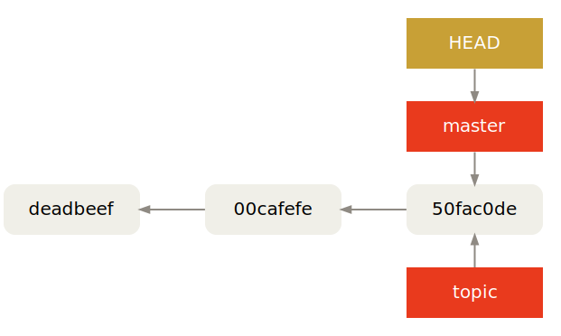

You see that the repository contains now an additional branch but the HEAD pointer still points to the old one.

To actually switch the branch:

```
$ git checkout topic
Switched to branch 'topic'
```

The repository state should be now like this:


The commands `git branch {branch name}` and `git checkout {branch name}` can be combined to:

```
$ git checkout -b {branch name}
Switched to a new branch '{branch name}'
```

## Committing on branches

After you switched the branch you can commit your changes as usual. After making a commit, the repository will look like this:


The "current" branch pointer advances with your commits while other branch pointers are not touched. If you switch the branch again (assume "master" in this example) the working directory will be set to the state where the last commit was made on this branch.


If you make a commit on the "master" branch now, the history will diverge:

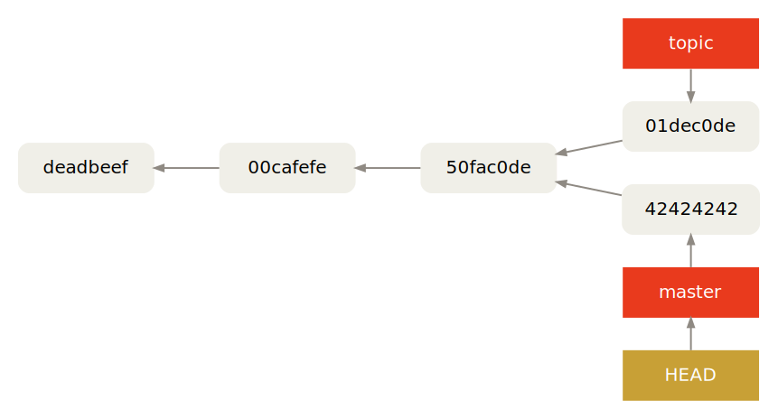

## Example

Assuming your repository has this log (played through the "First steps" example):

```
$ git log --oneline
25632ea Modify a file
3dc35b9 My first commit
```

Typing `git branch` inside your repository should give you this output:

```
$ git branch
* master
```

The repository contains two commits in the "master" branch. The "master" branch is the only one. The asterisk in the output of `git branch` indicates that the HEAD pointer is pointing to the "master" branch.

Make a new branch and set the HEAD pointer to it:

```
$ git checkout -b my-test
Switched to a new branch 'my-test'
```

Create a new file, e.g. "test.txt".

Add this new file to the repository:

```
$ git add test.txt
```

And commit:

```
$ git commit -m "Add a test file"
[my-test e728269] Add a test file
 1 file changed, 1 insertion(+)
 create mode 100644 test.txt
```

Now `git log --oneline` should look like this:

```
$ git log --oneline
e728269 Add a test file
25632ea Modify a file
3dc35b9 My first commit
```

Switch back to the "master" branch and let show you the log:

```
$ git checkout master
Switched to branch 'master'
$ git log --oneline
25632ea Modify a file
3dc35b9 My first commit
```

You see that the log line `e728269 Add a test file` is missing in the "master" branch. The lines `3dc35b9 My first commit` and `25632ea Modify a file` were not modified by the operations and stay exactly identical.

Now create another file, add it to the repository and commit:

```
$ git add slave.txt
$ git commit -m "Add slave to master"
[master 9589a2d] Add slave to master
 1 file changed, 1 insertion(+)
 create mode 100644 slave.txt
```

The current repository log:

```
$ git log --oneline
9589a2d Add slave to master
25632ea Modify a file
3dc35b9 My first commit
```

### With Git Extensions

#### Create a new branch and switch to it

Step 1:

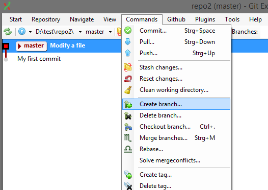

Step 2: Give a name and decide whether you want to checkout the branch right after creating:

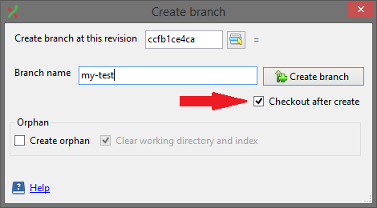

After Creating and confirming the message dialog, the main window should look like this:

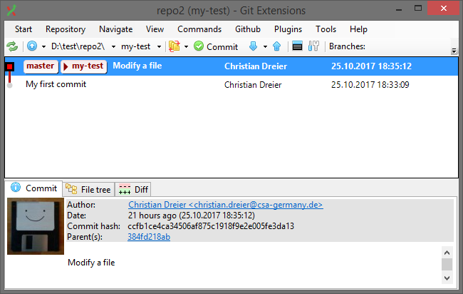

The arrow icon at "my-test" indicates that the HEAD pointer is set to the branch "my-test" ("my-test" is checked out).

#### Add a commit to branch "my-test"

Now add a new file and the main window should look like this:


The branch pointers "my-test" and "master" do not point to the same commit anymore.

#### Advance the "master" branch

The Git Extensions UI offers multiple possibilities to checkout a branch:

First alternative:

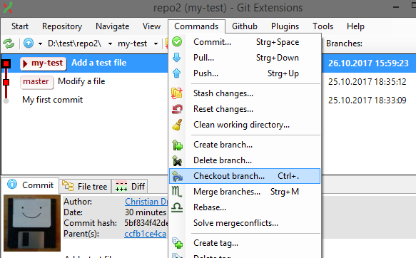

Second alternative:


Third alternative:

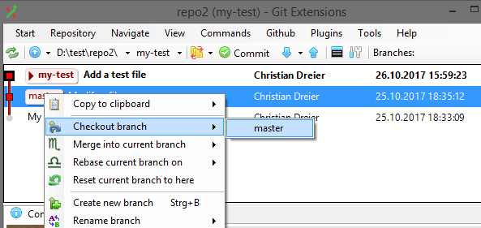

After the "master" branch is checked out, the main windows should look like this:


The UI indicates now that the branch "my-test" and the containing changes are irrelevant the current working directory state. The file that was added there has disappeared from the working directory.

After adding a new file and committing it, the main window should look like this:

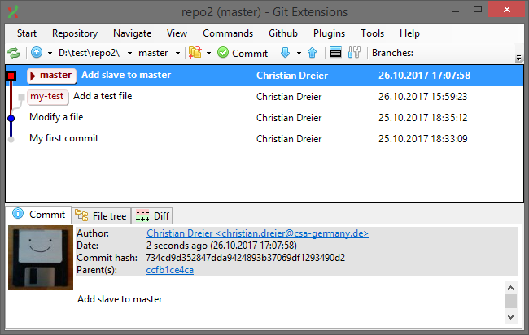

# Integration (merge and rebase)

Git has several strategies for merging. There are 3 basic ones:

- Fast-forward
- Recursive
- Rebase (use with caution)

Which of these strategies is most appropriate depends on the situation and your preferences.

If you type `git merge`, Git will default to fast-forward if possible, otherwise a recursive merge is performed.

## Fast-forward

A fast-forward merge can be performed if the history did not diverge:

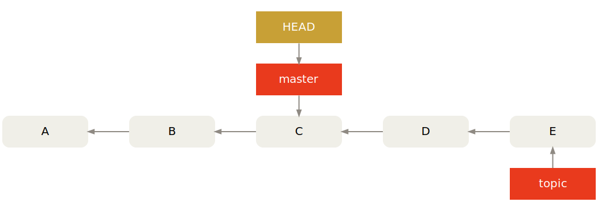

In this figure, the branch "topic" has only some commits that are not contained in the "master" branch. To get the content of the "topic" branch into the "master" branch, you have to checkout the "master" branch if it did not happen yet and type `git merge topic`. In this case Git has nothing more to do as setting the "master" branch pointer to the commit where the "topic" branch pointer points to and setting the working copy to the state of this commit.

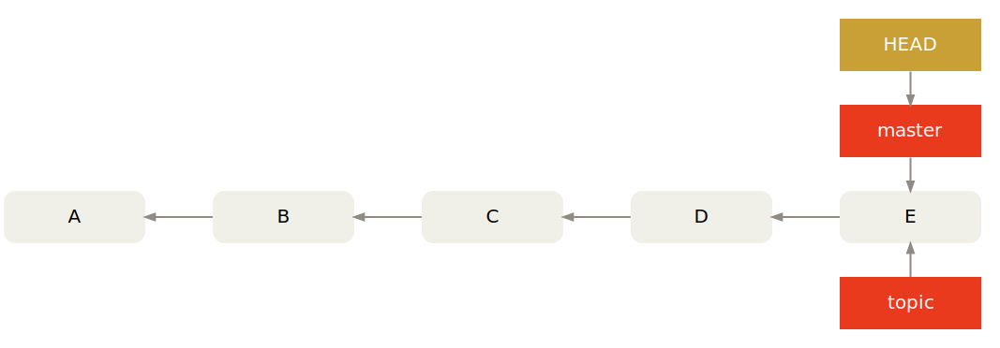

Note: with the flag `--ff-only` you can allow fast-forward merging only. If it is not possible to do a fast-forward merge, Git will abort with an error message.

## Recursive

If you want to merge branches that have both additional commits since the last common ancestor, Git has to use the recursive merge strategy.

Assume this commit history:

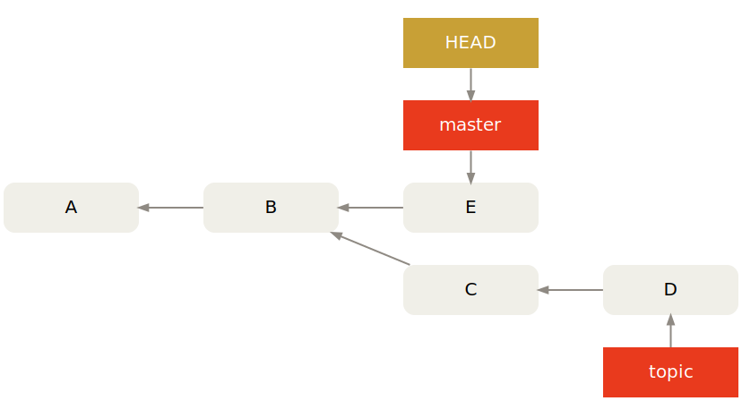

There is a commit on the "master" branch since the "topic" branch was created. To merge these branches, Git has to put the changes of them to a new commit:

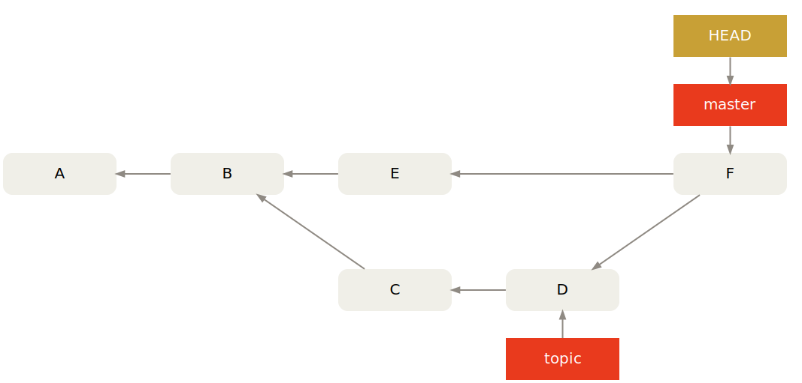

Note: with the flag `--no-ff` you can force Git to do a recursive merge, even if a fast-forward merge is possible. Some teams use this to preserve topic branches and the changes that belong to them.

## Rebase

Git allows you to change the commit history. All imaginable thinks are possible, e.g.

- Changing the order of commits
- Splitting commits
- Merging multiple commits to one
- Making a diverged history linear

These operations are called "rebase" operations, because most of them are done with the command `git rebase`. As in real life, changing the history is not trivial. All references must be rewritten to make the changed history to be considered the true one. As long as the history is only known to one person (meaning the commits are not published yet), it is not much a problem. But after publishing, all people that work with the rebased repository have to reproduce your rebase too.

A rebase is performed by creating new commits that are based on certain old commits. Because every rebase changes some data of commits to rebase, the new commits get new hash sums. Branch pointers have to be updated too - otherwise the old commits that were rebased will stay visible as long as they are reachable by a branch pointer.

A diverged history that was rebased to linear can look like following:

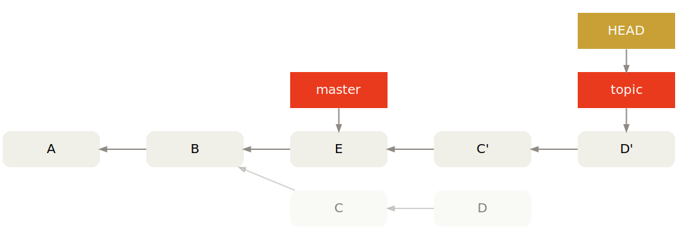

There is a "topic" branch those original parent commit is `B` (a SHA1 hash in a real repository) and was rebased that `E` is now the parent commit. The figure implies that the SHA1 hash is recalculated with changed data (`C'` instead of `C`).

Note: some operations are not done with `git rebase`. One example is `git commit --amend` that allows you to correct the last commit. Another example is `git filter-branch` that lets you rewrite the history of all reachable commits with one command or script. Both Git commands will be examined in the examples below.

## Examples

### Fast-forward

First, make a new branch and switch to it:

```
$ git checkout -b to-be-fast-forwarded
Switched to a new branch 'to-be-fast-forwarded'
```

Change a file and commit the change (e.g. an additional text line in "hello.txt"):

```
$ git commit -am "Improve greeting"
[to-be-fast-forwarded 4ebf636] Improve greeting
 1 file changed, 1 insertion(+)
```

Note the additional flag `-a` in this example. The above line is abbreviation of these two commands:

```
$ git add .
$ git commit -m "Improve greeting"
```

To merge "to-be-fast-forwarded" into "master", you have to checkout "master" (meaning "master" has to be made the current branch):

```
$ git checkout master
Switched to branch 'master'
```

Then merge:

```
$ git merge to-be-fast-forwarded
Updating 9589a2d..4ebf636
Fast-forward
 hello.txt | 1 +
 1 file changed, 1 insertion(+)
```

Git said that it performed a "Fast-forward" merge. The branch pointers "master" and "to-be-fast-forwarded" point now to the same commit and the commit history is linear.

### Recursive

If you still reproduce the examples with the repository of the beginning (recommended), you should have a branch "my-test". If not, make it and put a file there (e.g. "test.txt").

Now merge:

```
$ git merge my-test
Merge made by the 'recursive' strategy.
 test.txt | 1 +
 1 file changed, 1 insertion(+)
 create mode 100644 test.txt
```

Git said that it made a "recursive" merge. Typing `git log --oneline --graph` will give you this output:

```
$ git log --oneline --graph
*   2e32353 Merge branch 'my-test'
|\
| * e728269 Add a test file
* | 4ebf636 Improve greeting
* | 9589a2d Add slave to master
|/
* 25632ea Modify a file
* 3dc35b9 My first commit
```

As you see in the output above, the commit history consists now of two parallel lines that have their root at commit "25632ea" and are merged in a so called "merge commit". This commit was created automatically by Git. If you prefer to commit manually after merge (e.g. to put your own commit message), you have to type `git merge --no-commit {branch name}` instead.

### Rebase examples

#### Make diverged history linear

To perform a very basic example, the example repository will be rebased that the diverged history will be made linear. First, type:

```
$ git rebase -i HEAD~2
```

`-i` means that an "interactive" rebased will be performed. `HEAD~2` means that the last two commits will be rebased - merge commits are not counted here. After typing the above line (and pressing the Enter key), a text editor will appear that contains following text:

```
pick 3efacf6 Improve greeting
pick 6e6ad01 Add a test file

# Rebase fcfa7b8..3840051 onto fcfa7b8 (2 commands)
#
# Commands:
# p, pick = use commit
# r, reword = use commit, but edit the commit message
# e, edit = use commit, but stop for amending
# s, squash = use commit, but meld into previous commit
# f, fixup = like "squash", but discard this commit's log message
# x, exec = run command (the rest of the line) using shell
# d, drop = remove commit
#
# These lines can be re-ordered; they are executed from top to bottom.
#
# If you remove a line here THAT COMMIT WILL BE LOST.
#
# However, if you remove everything, the rebase will be aborted.
#
# Note that empty commits are commented out
```

Actually, a kind of script will be executed by Git in this case. The lines that start with `#` are comments. You can abort the rebase at this point by deleting the first two lines, saving the text and closing the editor - no line to execute says Git that there is nothing to do. Note that the commits here are in opposite order - the newer commits are below the older ones.

In this example there is not more to do as closing the text editor containing the default text. Git will then perform the rebase. A `git log --oneline --graph --all` will look almost as intended:

```
$ git rebase -i HEAD~2
Successfully rebased and updated refs/heads/master.
$ git log --oneline --graph --all
* 418ac30 Add a test file
* 3efacf6 Improve greeting
* fcfa7b8 Add slave to master
| * 6e6ad01 Add a test file
|/
* a6d57e3 Modify a file
* 0c55337 My first commit
```

But the branch "my-test" is still in the repository and we have now two commits with the same message "Add a test file". To have a clean, linear commit history, we just have to delete the "my-test" branch:

```
$ git branch -D my-test
Deleted branch my-test (was 6e6ad01).
$ git log --oneline --graph --all
* 418ac30 Add a test file
* 3efacf6 Improve greeting
* fcfa7b8 Add slave to master
* a6d57e3 Modify a file
* 0c55337 My first commit
```

Note, that `-D` instead of `-d` was used. Git has to be forced to delete the branch because the commits of that branch will be not reachable by any branch and their changes would be lost in normal circumstances.

#### Correct last commit

It happens quiet fast that an erroneous commit is made. One way to fix this is to make "correction commits" that contain messages like "Fixed typo", "Fixed build error", "Forgot to add a file" etc. This is not pretty and it is not possible this way to fix typos in the commit message itself. A common solution to this problem is `git commit --amend`.

Put a file in your repository, e.g. "error.txt" with this content:

```
Sum errorz here
```

Commit:

```
$ git add error.txt
$ git commit -m "Introduse errorz"
[master e115c2e] Introduse errorz
 1 file changed, 1 insertion(+)
 create mode 100644 error.txt
```

Note the manual `git add ...` before the actual commit. The command `git commit -a` only adds file to the staging area that are already tracked (meaning known to the VCS) but modified. New files are not tracked yet and have to be added manually to the staging area.

Now let's fix this commit. The content of "errror.txt" should look as following:

```
Some errors here
```

Add the change to the staging area:

```
$ git add error.txt
```

And recommit (with no typo in the message either):

```
$ git commit --amend -m "Introduce errors"
[master 979003e] Introduce errors
 Date: Fri Nov 3 15:52:26 2017 +0100
 1 file changed, 1 insertion(+)
 create mode 100644 error.txt
$ git log --oneline --graph --all
* 979003e Introduce errors
* 7e8d078 Add a test file
* 4ebf636 Improve greeting
* 9589a2d Add slave to master
* 25632ea Modify a file
* 3dc35b9 My first commit
```

As you see in the output of `git log`, the commit history now looks as the last commit was always this way.

#### Delete files out of the complete history

For this example, it seems appropriate to create a Visual Studio project in a new repository. Assume a console application named "hello". Initialize the repository and make your first commit right after creating the Visual Studio solution:

```
$ git init
Initialized empty Git repository in D:/test/hello/.git/
$ git add .
$ git commit -m Initialize
[master (root-commit) 590fa0c] Initialize
 15 files changed, 163 insertions(+)
 create mode 100644 .vs/hello/v14/.suo
 create mode 100644 hello.sln
 create mode 100644 hello/App.config
 create mode 100644 hello/Program.cs
 create mode 100644 hello/Properties/AssemblyInfo.cs
 create mode 100644 hello/bin/Debug/hello.exe.config
 create mode 100644 hello/bin/Debug/hello.vshost.exe
 create mode 100644 hello/bin/Debug/hello.vshost.exe.config
 create mode 100644 hello/bin/Debug/hello.vshost.exe.manifest
 create mode 100644 hello/hello.csproj
 create mode 100644 hello/obj/Debug/DesignTimeResolveAssemblyReferencesInput.cache
 create mode 100644 hello/obj/Debug/TemporaryGeneratedFile_036C0B5B-1481-4323-8D20-8F5ADCB23D92.cs
 create mode 100644 hello/obj/Debug/TemporaryGeneratedFile_5937a670-0e60-4077-877b-f7221da3dda1.cs
 create mode 100644 hello/obj/Debug/TemporaryGeneratedFile_E7A71F73-0F8D-4B9B-B56E-8E70B10BC5D3.cs
 create mode 100644 hello/obj/Debug/hello.csproj.FileListAbsolute.txt
```

You see in the output of `git commit` that there are already files that should not be committed usually. But we go further: add some content to the file "Program.cs" - e.g. like this:

```csharp
using System;

namespace hello
{
    class Program
    {
        static void Main(string[] args)
        {
            Console.WriteLine("Hello, world!");
        }
    }
}
```

Now build the solution (Ctrl+Shift+B in Visual Studio), add some additional yet untracked files and commit:

```
$ git add .
$ git commit -m "First approach to solve this complex problem"
[master 02f7599] First approach to solve this complex problem
 7 files changed, 6 insertions(+), 4 deletions(-)
 create mode 100644 hello/bin/Debug/hello.exe
 create mode 100644 hello/bin/Debug/hello.pdb
 create mode 100644 hello/obj/Debug/hello.csprojResolveAssemblyReference.cache
 create mode 100644 hello/obj/Debug/hello.exe
 create mode 100644 hello/obj/Debug/hello.pdb
```

Now we have two commits that both contain a bunch of generated files that should never be committed. To delete these files:

```
$ git filter-branch --index-filter 'git rm --cached --ignore-unmatch hello/bin/* hello/obj/* .vs/*' HEAD
Rewrite 590fa0c172c1abb942f2a65b70650a19b439c2ec (1/2) (0 seconds passed, remaining 0 predicted)    rm '.vs/hello/v14/.suo'
rm 'hello/bin/Debug/hello.exe.config'
rm 'hello/bin/Debug/hello.vshost.exe'
rm 'hello/bin/Debug/hello.vshost.exe.config'
rm 'hello/bin/Debug/hello.vshost.exe.manifest'
rm 'hello/obj/Debug/DesignTimeResolveAssemblyReferencesInput.cache'
rm 'hello/obj/Debug/TemporaryGeneratedFile_036C0B5B-1481-4323-8D20-8F5ADCB23D92.cs'
rm 'hello/obj/Debug/TemporaryGeneratedFile_5937a670-0e60-4077-877b-f7221da3dda1.cs'
rm 'hello/obj/Debug/TemporaryGeneratedFile_E7A71F73-0F8D-4B9B-B56E-8E70B10BC5D3.cs'
rm 'hello/obj/Debug/hello.csproj.FileListAbsolute.txt'
Rewrite 02f759993479e45f75c588023e87fbe9c12e248d (2/2) (1 seconds passed, remaining 0 predicted)    rm '.vs/hello/v14/.suo'
rm 'hello/bin/Debug/hello.exe'
rm 'hello/bin/Debug/hello.exe.config'
rm 'hello/bin/Debug/hello.pdb'
rm 'hello/bin/Debug/hello.vshost.exe'
rm 'hello/bin/Debug/hello.vshost.exe.config'
rm 'hello/bin/Debug/hello.vshost.exe.manifest'
rm 'hello/obj/Debug/DesignTimeResolveAssemblyReferencesInput.cache'
rm 'hello/obj/Debug/TemporaryGeneratedFile_036C0B5B-1481-4323-8D20-8F5ADCB23D92.cs'
rm 'hello/obj/Debug/TemporaryGeneratedFile_5937a670-0e60-4077-877b-f7221da3dda1.cs'
rm 'hello/obj/Debug/TemporaryGeneratedFile_E7A71F73-0F8D-4B9B-B56E-8E70B10BC5D3.cs'
rm 'hello/obj/Debug/hello.csproj.FileListAbsolute.txt'
rm 'hello/obj/Debug/hello.csprojResolveAssemblyReference.cache'
rm 'hello/obj/Debug/hello.exe'
rm 'hello/obj/Debug/hello.pdb'

Ref 'refs/heads/master' was rewritten
```

The above command consists of two nested parts:

1. `git filter-branch --index-filter '<COMMAND>' HEAD`
2. "&lt;COMMAND&gt;" = `git rm --cached --ignore-unmatch hello/bin/* hello/obj/* .vs/*`

The first part of the command says Git that all commits reachable by the HEAD pointer shall be rewritten. The second part will be executed with every commit - in this example certain files shall be deleted.

When you type `git log --patch` you will see that the files are really not in the history anymore:

```
$ git log --patch
commit 1e378e735e28bb795d39b0a6207e3f3a31eb919a
Author: Christian Dreier <christian.dreier@csa-germany.de>
Date:   Fri Nov 3 16:27:57 2017 +0100

    First approach to solve this complex problem

diff --git a/hello/Program.cs b/hello/Program.cs
index aa9da9c..5bd13ab 100644
--- a/hello/Program.cs
+++ b/hello/Program.cs
@@ -1,8 +1,4 @@
 ´╗┐using System;
-using System.Collections.Generic;
-using System.Linq;
-using System.Text;
-using System.Threading.Tasks;
 
 namespace hello
 {
@@ -10,6 +6,7 @@ namespace hello
     {
         static void Main(string[] args)
         {
+            Console.WriteLine("Hello, world!");
         }
     }
 }

commit 5549a6c8b1c8829020176ce18bb2c24c542b1de2
Author: Christian Dreier <christian.dreier@csa-germany.de>
Date:   Fri Nov 3 16:18:25 2017 +0100

    Initialize

diff --git a/hello.sln b/hello.sln
new file mode 100644
index 0000000..9f54cb3
--- /dev/null
+++ b/hello.sln
@@ -0,0 +1,22 @@
+´╗┐
+Microsoft Visual Studio Solution File, Format Version 12.00
+# Visual Studio 14
+VisualStudioVersion = 14.0.24720.0
+MinimumVisualStudioVersion = 10.0.40219.1
+Project("{FAE04EC0-301F-11D3-BF4B-00C04F79EFBC}") = "hello", "hello\hello.csproj", "{F0388065-CAD5-4C07-B4EA-66DB6334EE34}"
+EndProject
+Global
+	GlobalSection(SolutionConfigurationPlatforms) = preSolution
+		Debug|Any CPU = Debug|Any CPU
+		Release|Any CPU = Release|Any CPU
+	EndGlobalSection
+	GlobalSection(ProjectConfigurationPlatforms) = postSolution
+		{F0388065-CAD5-4C07-B4EA-66DB6334EE34}.Debug|Any CPU.ActiveCfg = Debug|Any CPU
+		{F0388065-CAD5-4C07-B4EA-66DB6334EE34}.Debug|Any CPU.Build.0 = Debug|Any CPU
+		{F0388065-CAD5-4C07-B4EA-66DB6334EE34}.Release|Any CPU.ActiveCfg = Release|Any CPU
+		{F0388065-CAD5-4C07-B4EA-66DB6334EE34}.Release|Any CPU.Build.0 = Release|Any CPU
+	EndGlobalSection
+	GlobalSection(SolutionProperties) = preSolution
+		HideSolutionNode = FALSE
+	EndGlobalSection
+EndGlobal
diff --git a/hello/App.config b/hello/App.config
new file mode 100644
index 0000000..d740e88
--- /dev/null
+++ b/hello/App.config
@@ -0,0 +1,6 @@
+´╗┐<?xml version="1.0" encoding="utf-8" ?>
+<configuration>
+    <startup> 
+        <supportedRuntime version="v4.0" sku=".NETFramework,Version=v4.5.2" />
+    </startup>
+</configuration>
\ No newline at end of file
diff --git a/hello/Program.cs b/hello/Program.cs
new file mode 100644
index 0000000..aa9da9c
--- /dev/null
+++ b/hello/Program.cs
@@ -0,0 +1,15 @@
+´╗┐using System;
+using System.Collections.Generic;
+using System.Linq;
+using System.Text;
+using System.Threading.Tasks;
+
+namespace hello
+{
+    class Program
+    {
+        static void Main(string[] args)
+        {
+        }
+    }
+}
diff --git a/hello/Properties/AssemblyInfo.cs b/hello/Properties/AssemblyInfo.cs
new file mode 100644
index 0000000..473b520
--- /dev/null
+++ b/hello/Properties/AssemblyInfo.cs
@@ -0,0 +1,36 @@
+´╗┐using System.Reflection;
+using System.Runtime.CompilerServices;
+using System.Runtime.InteropServices;
+
+// General Information about an assembly is controlled through the following 
+// set of attributes. Change these attribute values to modify the information
+// associated with an assembly.
+[assembly: AssemblyTitle("hello")]
+[assembly: AssemblyDescription("")]
+[assembly: AssemblyConfiguration("")]
+[assembly: AssemblyCompany("")]
+[assembly: AssemblyProduct("hello")]
+[assembly: AssemblyCopyright("Copyright ┬®  2017")]
+[assembly: AssemblyTrademark("")]
+[assembly: AssemblyCulture("")]
+
+// Setting ComVisible to false makes the types in this assembly not visible 
+// to COM components.  If you need to access a type in this assembly from 
+// COM, set the ComVisible attribute to true on that type.
+[assembly: ComVisible(false)]
+
+// The following GUID is for the ID of the typelib if this project is exposed to COM
+[assembly: Guid("f0388065-cad5-4c07-b4ea-66db6334ee34")]
+
+// Version information for an assembly consists of the following four values:
+//
+//      Major Version
+//      Minor Version 
+//      Build Number
+//      Revision
+//
+// You can specify all the values or you can default the Build and Revision Numbers 
+// by using the '*' as shown below:
+// [assembly: AssemblyVersion("1.0.*")]
+[assembly: AssemblyVersion("1.0.0.0")]
+[assembly: AssemblyFileVersion("1.0.0.0")]
diff --git a/hello/hello.csproj b/hello/hello.csproj
new file mode 100644
index 0000000..c4c0443
--- /dev/null
+++ b/hello/hello.csproj
@@ -0,0 +1,60 @@
+´╗┐<?xml version="1.0" encoding="utf-8"?>
+<Project ToolsVersion="14.0" DefaultTargets="Build" xmlns="http://schemas.microsoft.com/developer/msbuild/2003">
+  <Import Project="$(MSBuildExtensionsPath)\$(MSBuildToolsVersion)\Microsoft.Common.props" Condition="Exists('$(MSBuildExtensionsPath)\$(MSBuildToolsVersion)\Microsoft.Common.props')" />
+  <PropertyGroup>
+    <Configuration Condition=" '$(Configuration)' == '' ">Debug</Configuration>
+    <Platform Condition=" '$(Platform)' == '' ">AnyCPU</Platform>
+    <ProjectGuid>{F0388065-CAD5-4C07-B4EA-66DB6334EE34}</ProjectGuid>
+    <OutputType>Exe</OutputType>
+    <AppDesignerFolder>Properties</AppDesignerFolder>
+    <RootNamespace>hello</RootNamespace>
+    <AssemblyName>hello</AssemblyName>
+    <TargetFrameworkVersion>v4.5.2</TargetFrameworkVersion>
+    <FileAlignment>512</FileAlignment>
+    <AutoGenerateBindingRedirects>true</AutoGenerateBindingRedirects>
+  </PropertyGroup>
+  <PropertyGroup Condition=" '$(Configuration)|$(Platform)' == 'Debug|AnyCPU' ">
+    <PlatformTarget>AnyCPU</PlatformTarget>
+    <DebugSymbols>true</DebugSymbols>
+    <DebugType>full</DebugType>
+    <Optimize>false</Optimize>
+    <OutputPath>bin\Debug\</OutputPath>
+    <DefineConstants>DEBUG;TRACE</DefineConstants>
+    <ErrorReport>prompt</ErrorReport>
+    <WarningLevel>4</WarningLevel>
+  </PropertyGroup>
+  <PropertyGroup Condition=" '$(Configuration)|$(Platform)' == 'Release|AnyCPU' ">
+    <PlatformTarget>AnyCPU</PlatformTarget>
+    <DebugType>pdbonly</DebugType>
+    <Optimize>true</Optimize>
+    <OutputPath>bin\Release\</OutputPath>
+    <DefineConstants>TRACE</DefineConstants>
+    <ErrorReport>prompt</ErrorReport>
+    <WarningLevel>4</WarningLevel>
+  </PropertyGroup>
+  <ItemGroup>
+    <Reference Include="System" />
+    <Reference Include="System.Core" />
+    <Reference Include="System.Xml.Linq" />
+    <Reference Include="System.Data.DataSetExtensions" />
+    <Reference Include="Microsoft.CSharp" />
+    <Reference Include="System.Data" />
+    <Reference Include="System.Net.Http" />
+    <Reference Include="System.Xml" />
+  </ItemGroup>
+  <ItemGroup>
+    <Compile Include="Program.cs" />
+    <Compile Include="Properties\AssemblyInfo.cs" />
+  </ItemGroup>
+  <ItemGroup>
+    <None Include="App.config" />
+  </ItemGroup>
+  <Import Project="$(MSBuildToolsPath)\Microsoft.CSharp.targets" />
+  <!-- To modify your build process, add your task inside one of the targets below and uncomment it. 
+       Other similar extension points exist, see Microsoft.Common.targets.
+  <Target Name="BeforeBuild">
+  </Target>
+  <Target Name="AfterBuild">
+  </Target>
+  -->
+</Project>
\ No newline at end of file

```

Finally, to keep the repository clean in the future, a ".gitignore" file should be added.

Content of ".gitignore":

```
bin/
obj/
.vs/
```

In this example, the directories for the Visual Studio build system is ignored and the directory for the Visual Studio user settings.

Add ".gitignore" to repository and commit:

```
$ git add .gitignore
$ git commit -m "Ignore generated files"
[master 4013b9a] Ignore generated files
 1 file changed, 3 insertions(+)
 create mode 100644 .gitignore
```

If you now open the Visual Studio solution file and build it, you will see that Git will not discover any files anymore that are not supposed to be committed.

Note for the practice that the ".gitignore" file in this example is very rudimentary and a real project will probably have several other files that shall be ignored.

Important: Doing this with a published repository should be avoided as much as possible. If it is not possible to avoid this, you should inform all the people that work with this repository to let them rebase their repositories.

## Notes to rebasing

It is always a good idea to backup your repository if you attempt any rebase operations and are not sure whether you do the right thing.

If you want to `git filter-branch` a repository after it was published already (or perform other rebase operations), you should make sure that all project participants are prepared for this. This means they should:

1. Published their current state of work
2. Made backups of their repositories
3. After you published the rewritten repository (`git push --force` will do the job), the other participants should rebase their repositories to the published rewritten one.
   - Alternatively they can clone a fresh repository out of the rewritten central one.

### Notes to `git filter-branch`

`git filter-branch` is considered the nuclear option (as mentioned in the ["Pro Git" book](https://git-scm.com/book/en/v2/Git-Tools-Rewriting-History)). It basically rewrites the whole repository or at least a big part of it.

Make sure that you have a backup of your repository before attempting such operations.

As you see in the example, `git filter-branch` can be quiet complicated. Unfortunately Git Extensions seems not to offer Filter-Branch operations but there is another tool that promises to make Filter-Branch operations much easier named [BFG Repo-Cleaner](https://rtyley.github.io/bfg-repo-cleaner/) (not tried by the author). You should try it especially if you have multiple repositories containing files that should never be committed.

### With Git Extensions

#### Fast-forward

1. Create a new merge, named "to-be-fast-forwarded"
2. Change content of "hello.txt"
3. Commit

Your history should look like this now:

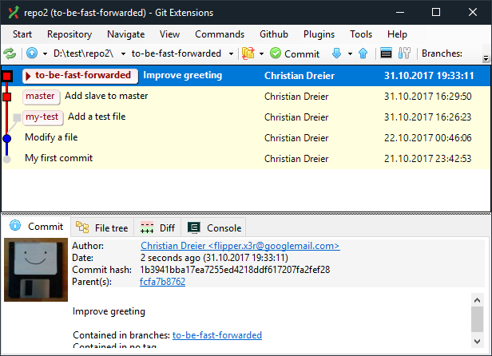

Now, start merging:

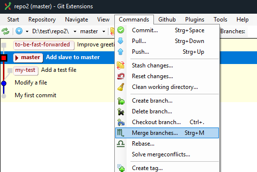

A dialog will open, offering options for the merge. Choose the branch that will be merged into the current one  and make sure that the option "Keep single branch line if possible (fast-forward)" is selected:

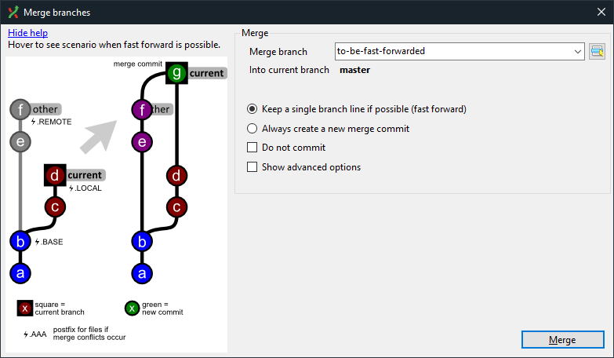

After confirming this dialog and the message window afterwards the history should look like this now:

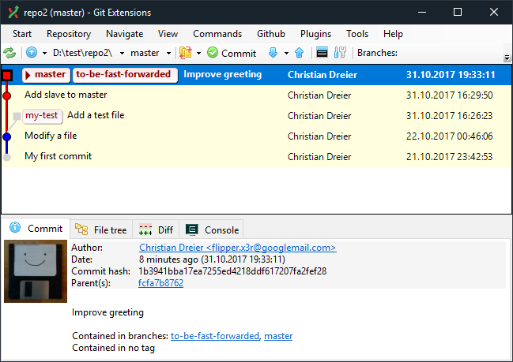

#### Recursive

Now, merge the branch "my-test" into the current branch "master":

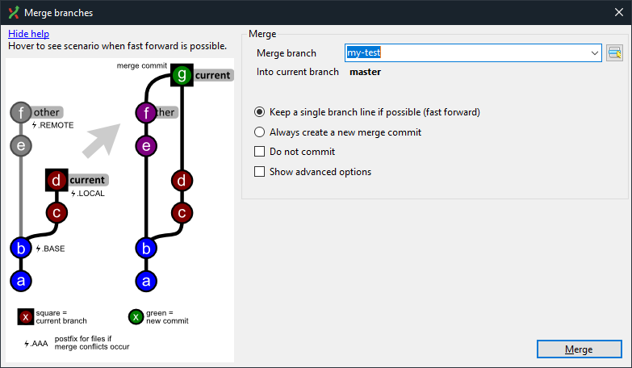

After that, the history should look like this:

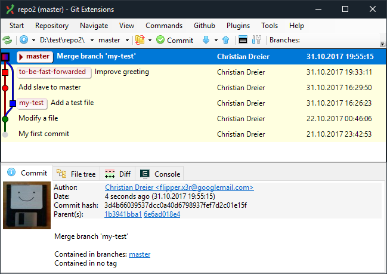

#### Rebasing

##### Make diverged history linear

Note: The following example was constructed to match the above CLI example. There are multiple ways to archive the same result.

To rebase, select this command:

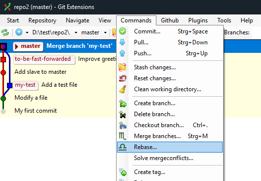

A dialog appears. After clicking on "Show options", you will see additional options that are needed for this example:

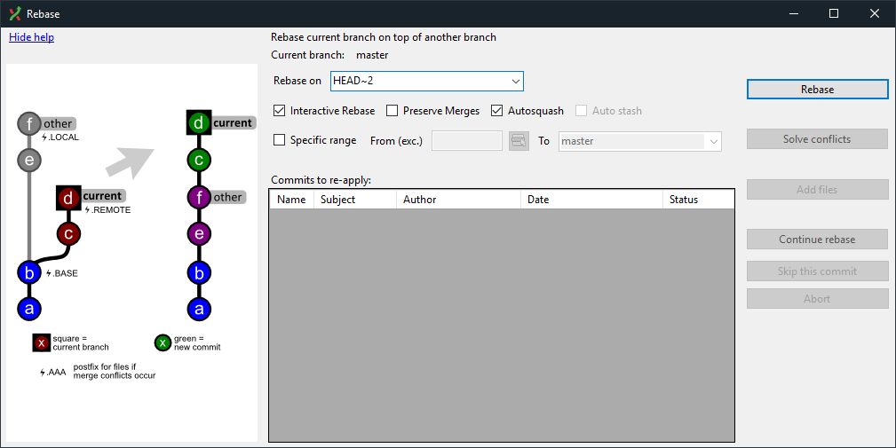

Type in the field "Rebase on" the text `HEAD~2` and check the checkbox "Interactive Rebase". The other checkboxes can be left in their default state. After clicking on the button "Rebase", a text editor should appear:

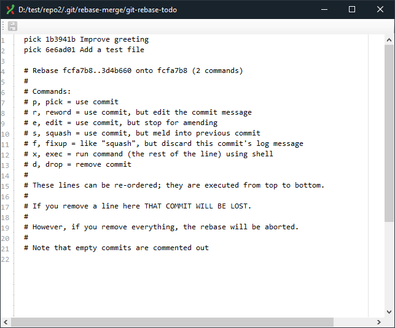

This looks the same as in the corresponding CLI example. You can just close the editor. The history should now look like this:

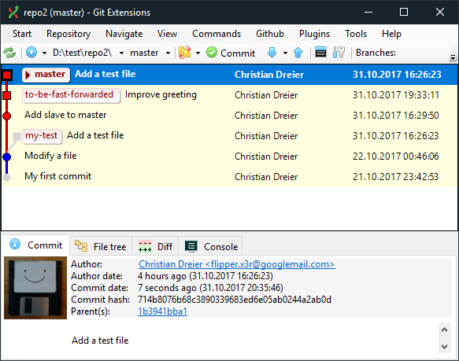

Now, delete the branch "my-test":

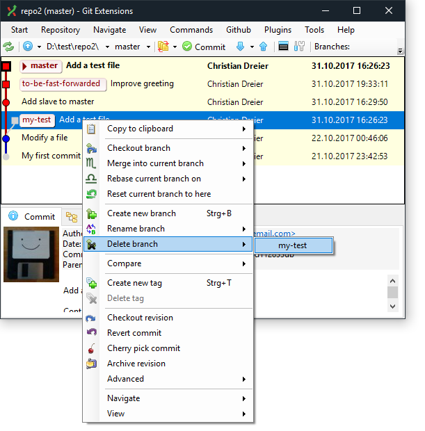

Take care to check the checkbox "Force delete" in the "Delete branch" dialog:

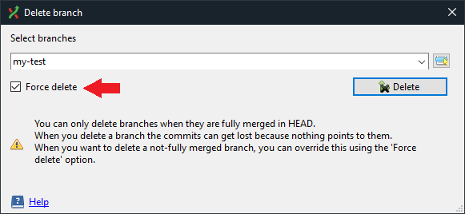

The history should look as clean as this now:

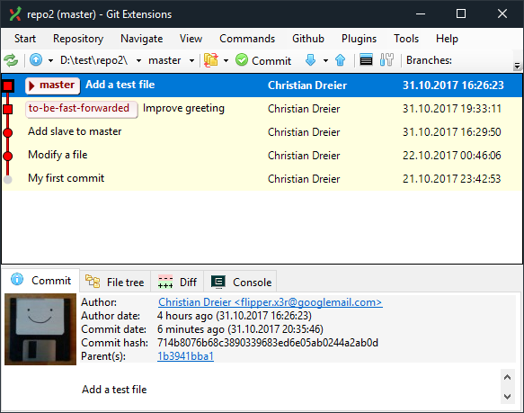

##### Correct last commit

Add a file named "error.txt" containing this content:

```
Sum errorz here
```

And commit:

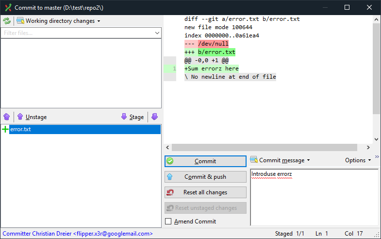

Now the commit history could look like this:

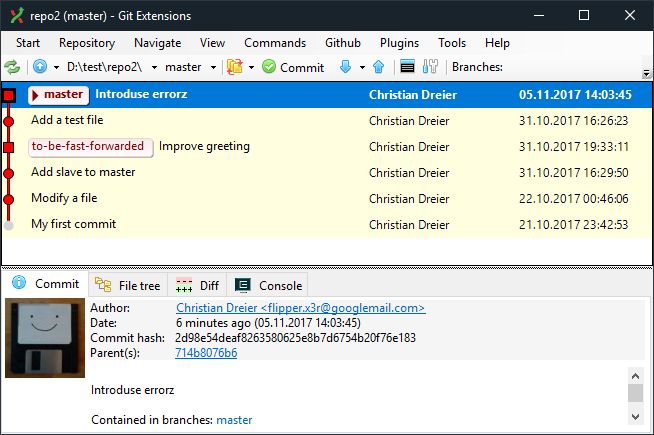

Now change "error.txt" that it has this content:

```
Some errors here
```

Now do an "amend commit" - check the checkbox "Amend Commit":

1:

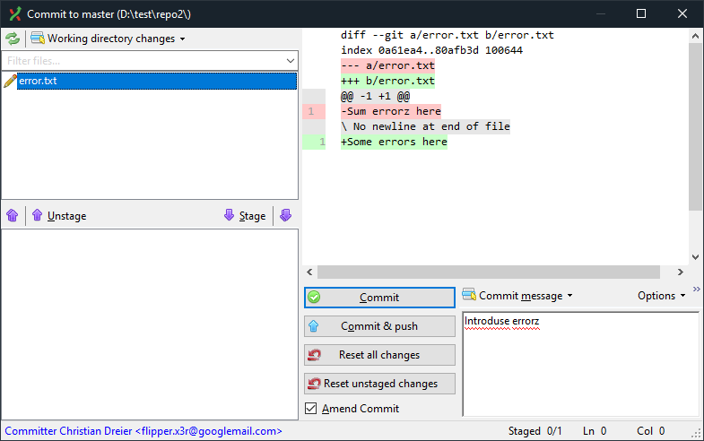

2:

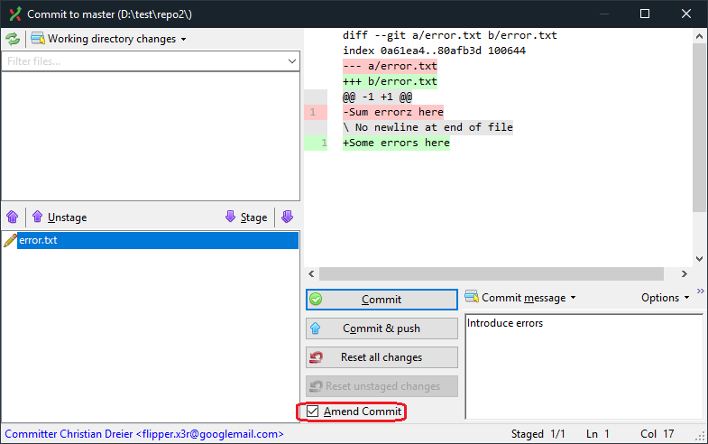

After clicking on the "Commit" button and confirming a confirmation dialog the history should look like this now:

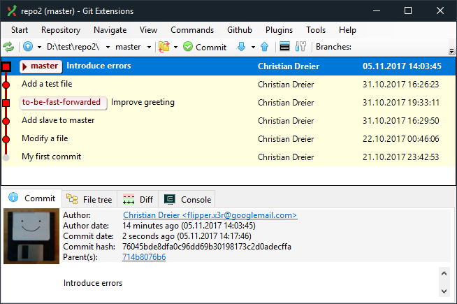

## Handling merge conflicts

As other VCSs, Git cannot merge automatically if the same file was edited at the same place in two branches. When this occurs, Git will not perform an automatic merge commit. The user is supposed to resolve these conflicts first and then commit.

Note: You can decide to not solve the conflicts yet by typing `git merge --abort`. This will put back your repository, including the working directory to a clean state.

### Example

Assume a repository with a branch "master" that contains a file "hello.txt" with this content:

```
Hello, people
Nice to meet you
```

Checkout a new branch:

```
$ git checkout -b to-be-conflicted
Switched to a new branch 'to-be-conflicted'
```

Modify the file "hello.txt", e.g. by replacing "Hello" with "Hallo". `git status` should look like this:

```
$ git status
On branch to-be-conflicted
Changes not staged for commit:
  (use "git add <file>..." to update what will be committed)
  (use "git checkout -- <file>..." to discard changes in working directory)

        modified:   hello.txt

no changes added to commit (use "git add" and/or "git commit -a")
```

And commit:

```
$ git commit -am "Say hallo instead of hello"
[to-be-conflicted 2459d02] Say hallo instead of hello
 1 file changed, 1 insertion(+), 1 deletion(-)
```

Checkout the "master" branch and edit "hello.txt again at the same place, e.g. by replacing "Hello" with "Hola":

```
$ git checkout master

# ... Some edits

$ git commit -am "Say hola instead of hello"
[master 7861168] Say hola instead of hello
 1 file changed, 1 insertion(+), 1 deletion(-)
```

A merge now will lead to a conflict:

```
$ git merge to-be-conflicted
Auto-merging hello.txt
CONFLICT (content): Merge conflict in hello.txt
Automatic merge failed; fix conflicts and then commit the result.
```

Typing `git status`:

```
$ git status
On branch master
You have unmerged paths.
  (fix conflicts and run "git commit")
  (use "git merge --abort" to abort the merge)

Unmerged paths:
  (use "git add <file>..." to mark resolution)

        both modified:   hello.txt

no changes added to commit (use "git add" and/or "git commit -a")
```

The content of your file "hello.txt" should look like this:

```
<<<<<<< HEAD
Hola, people
=======
Hallo, people
>>>>>>> to-be-conflicted
Nice to meet you
```

The first line `<<<<<<< HEAD` marks the start of the change of the current branch. The line `=======` marks the end of the change of the current branch and the start of the change of the "other" branch (the branch that shall be merged into the current one). The end of the "other branch" change is marked by the line `>>>>>>> to-be-conflicted` ("to-be-conflicted" is the name of the other branch).

You can edit the conflicted file as you want - probably you want get rid of the conflict markers and choose one or the other change. Let's say both changes are not good and edit the file to look like this:

```
Greetings, people
Nice to meet you
```

Now mark the file as solved:

```
$ git add hello.txt
$ git status
On branch master
All conflicts fixed but you are still merging.
  (use "git commit" to conclude merge)

Changes to be committed:

        modified:   hello.txt

```

If you now type `git commit` only, a text editor, containing the standard merge commit message will appear. After closing the editor, the commit will be performed and the two conflicting branches are merged successfully:

```
$ git commit
[master 669d43d] Merge branch 'to-be-conflicted'
$ git log --oneline --graph
*   669d43d Merge branch 'to-be-conflicted'
|\
| * 1c14344 Say hallo instead of hello
* | 5c9a7bc Say hola instead of hello
|/
* 92eb6a5 Introduce errors
* 418ac30 Add a test file
* 3efacf6 Improve greeting
* fcfa7b8 Add slave to master
* a6d57e3 Modify a file
* 0c55337 My first commit
```

#### With Git Extensions

Assume a repository with a branch "master" that contains a file "hello.txt" with this content:

```
Hello, people
Nice to meet you
```

Checkout a new branch:

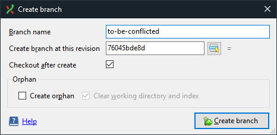

The new branch "to-be-conflicted" should now point to the same commit as "master" and be the current one (there is an arrow at the branch name "to-be-conflicted"):

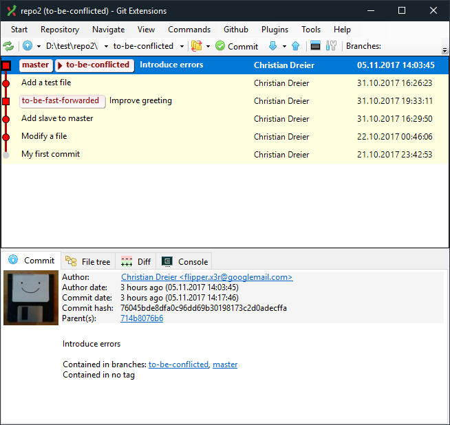

Modify the file "hello.txt", e.g. by replacing "Hello" with "Hallo" and commit:


Checkout the "master" branch, edit "hello.txt again at the same place, e.g. by replacing "Hello" with "Hola" and commit:

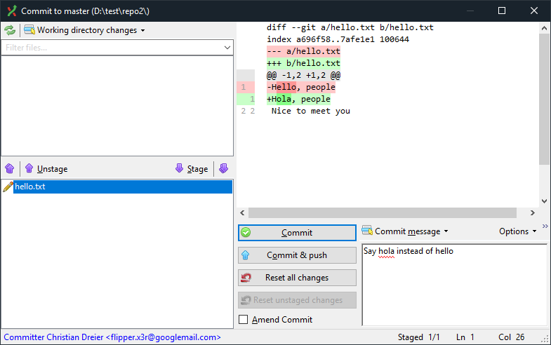

Your repository should now look like this:

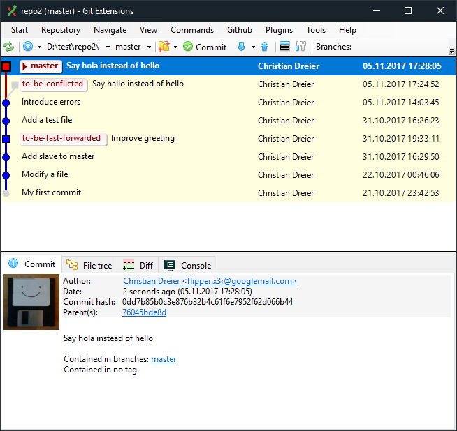

Now start merging:

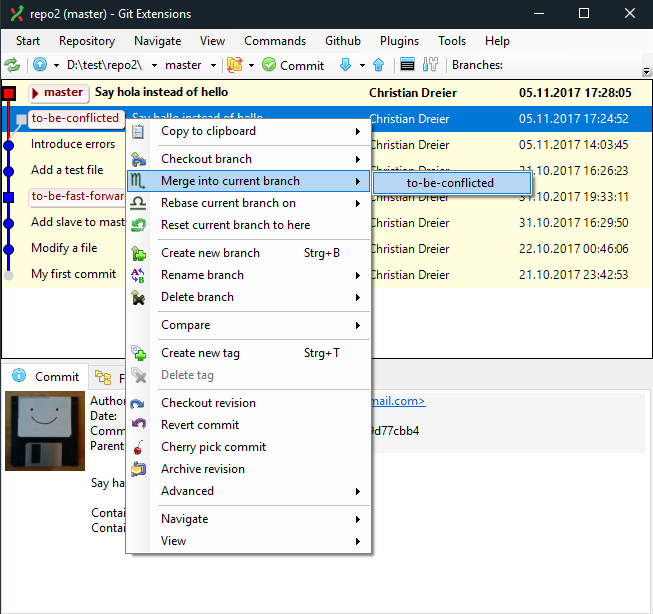

Select the branch to merge to the (current) "master" branch:

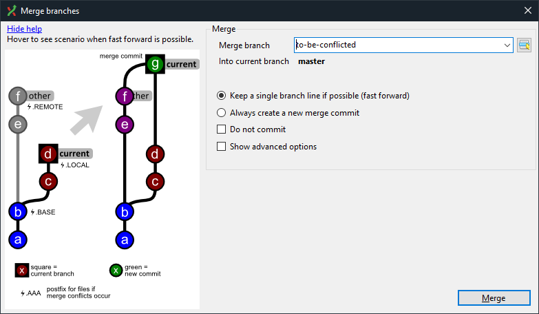

After you clicked on the button "Merge", you will get first an error in the message window:

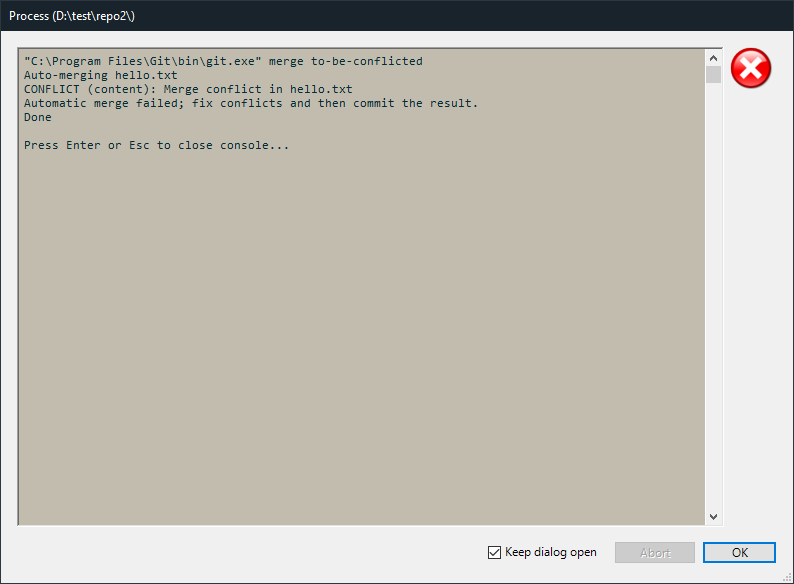

Choose to solve the merge conflicts now:

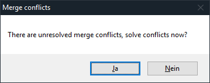

A dialog will appear - choose to start a merge tool:

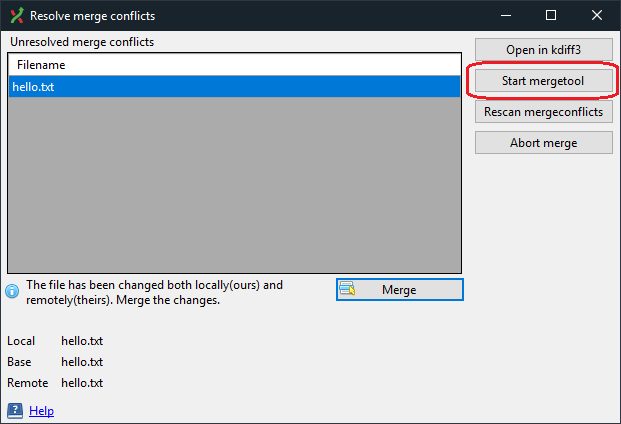

Usually a tool will open that is divided to three sides:

1. (A) The original from which the conflicted changes originated
2. (B) The change of the current branch ("master" in this case)
3. (C) The change of the other branch ("to-be-conflicted" in this case)

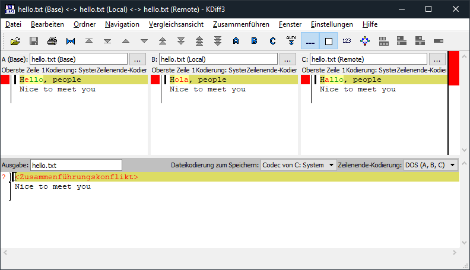

Let's say that both changes are not good and choose that original version:

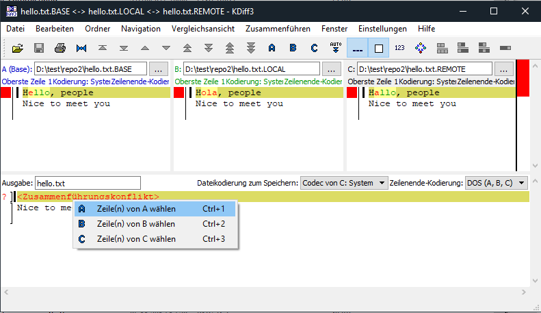

And save:

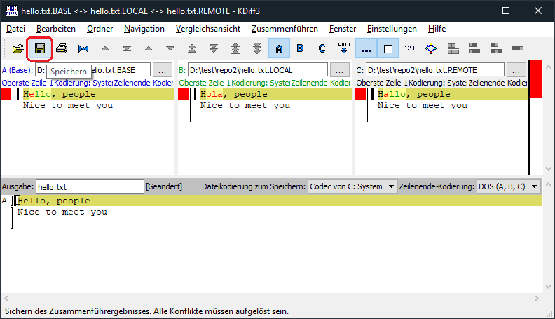

After you closed the merge tool window, a confirmation dialog appears whether you want to commit:

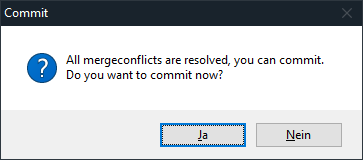

Add the file "hello.txt.orig" to the staging area and commit:

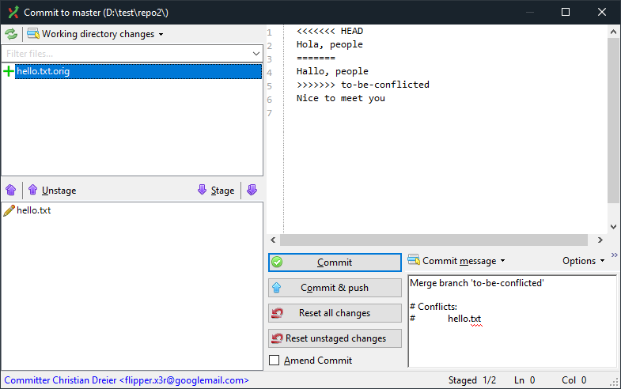

After successfully merging and committing, your commit history should look like this:

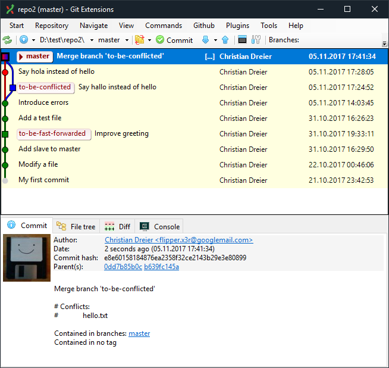

# Working with remote repositories

To work with other people on the same project, you need a repository that is reachable by all participants - a remote repository. In contrast to central VCSs, you do not need any special server instance or something (though Git repositories can be managed with help of specialized server software too). Like a personal Git repository, a remote repository is nothing more then a directory containing the repository data. In contrast to a personal repository, a remote repository does not contain a working copy but the repository data only. It can be on any place that seems appropriate: some HTTP server, a network file share or even on your local machine.

To publish your work on a remote repository, it must be registered in your personal repository. It is possible to have multiple remote repositories registered. Each remote repository has an alias name e.g. "origin". If you clone a personal repository from a remote one, the remote is registered automatically as "origin". The name "origin" is just the default one of the remote repository where you cloned from. Besides of this, the name "origin" has no special meaning and you are free to rename it to your preferences (though most people do not mind to change the default).

Refer book "Pro Git", [chapter 4.1 Git on the Server - The Protocols](https://git-scm.com/book/en/v2/Git-on-the-Server-The-Protocols) (and following chapters) for several possibilities to setup a remote repository.

## Basic commands

### `git init --bare`

Initializes a new "remote" repository in the current directory.

### `git clone {URL} {directory}`

Creates a new directory `{directory}` in the current directory and clones the remote repository under `{URL}`. The remote repository gets registered with name "origin" automatically.

### `git push {remote name} {branch name}`

Pushes the current state of branch `{branch name}` to the remote repository with name `{remote name}`.

### `git fetch {remote name}`

Fetches the content of the remote repository with name `{remote name}` to the personal one. Your local branches are not touched by this operation, meaning you have to merge your local branches to the corresponding remote branches manually.

### `git pull {remote name}`

Fetches the content of the remote repository with name `{remote name}` to the personal one and merges the local current branch to the corresponding remote one. Basically it behaves like `git fetch {remote name}` followed by `git merge {remote branch name}`.

If you want that your local branch is not merged with the last state of the remote branch but based on it in the history, you can say `git pull --rebase {remote name}`. This rebases your local branch to the last commit of the remote branch.

## Example

Make a new repository named "personal1":

```
$ mkdir personal1

# ...

$ cd personal1
$ git init
Initialized empty Git repository in D:/test/personal1/.git/
```

Create a file, e.g. "hello.txt" with this content:

```
Hello, world!
```

Commit:

```
$ git add hello.txt
$ git commit -m "Initialize"
[master (root-commit) 9e347be] Initialize
 1 file changed, 1 insertion(+)
 create mode 100644 hello.txt
```

Now create a "remote" repository on your local file system (there is no difference to a remote repository that lies somewhere in the network that matters for this example):

```
$ mkdir central.git

# ...

$ cd central.git
$ git init --bare
Initialized empty Git repository in D:/test/central.git/
```

Note that the directory containing the remote repository ends with ".git". It is a convention to end "bare" repositories (the kind that is used for remote repositories) with ".git" while personal repositories have no extension. As [mentioned in StackOverflow](https://stackoverflow.com/a/11069413), Git has some little convenience functionality regarding to the ".git" extension. But there is no technical reason to end the remote repository name with ".git".

Register the fresh remote repository in the personal repository:

```
$ cd ..\personal1
$ git remote add origin D:/test/central/
```

Note the slashes "`/` " instead of backslashes "`\`" in the windows path to the remote repository. Slashes should be preferred because it can be problematic using backslashes while slashes in remote URLs do not make any problems in any situation.

Now the data in the personal repository can be "pushed":

```
$ git push origin master
Counting objects: 3, done.
Writing objects: 100% (3/3), 238 bytes | 0 bytes/s, done.
Total 3 (delta 0), reused 0 (delta 0)
To D:/test/central/
 * [new branch]      master -> master
```

A `git log` in the central repository will now look exactly as `git log in your personal one:

```
$ git log
commit 9e347be6c7d02c7790d98a66cdce45941e841eb4
Author: Christian Dreier <christian.dreier@csa-germany.de>
Date:   Mon Nov 6 11:19:52 2017 +0100

    Initialize
$ cd ..\central
$ git log
commit 9e347be6c7d02c7790d98a66cdce45941e841eb4
Author: Christian Dreier <christian.dreier@csa-germany.de>
Date:   Mon Nov 6 11:19:52 2017 +0100

    Initialize
```

The way in this example to make a central repository out of an existing personal one is quiet cumbersome. The commands

- `mkdir central.git`
- `cd central.git` and
- `git push origin master` (to be done with the personal repository as current directory)

can be abbreviated by the single line `git clone --bare .\personal1 central-repo.git`. But the new remote repository has to be still registered in the personal one.

Now clone a second personal repository out of the remote one:

```
$ git clone central.git personal2
Cloning into 'personal2'...
done.
```

You will see that the cloned personal repository has registered the remote repository already and that its state is identical to the remote repository and the other personal one:

```
$ cd personal2
$ git remote show origin
* remote origin
  Fetch URL: D:/test/central.git
  Push  URL: D:/test/central.git
  HEAD branch: master
  Remote branch:
    master tracked
  Local branch configured for 'git pull':
    master merges with remote master
  Local ref configured for 'git push':
    master pushes to master (up to date)
$ git log
commit 9e347be6c7d02c7790d98a66cdce45941e841eb4
Author: Christian Dreier <christian.dreier@csa-germany.de>
Date:   Mon Nov 6 11:19:52 2017 +0100

    Initialize
```

# Workflows

## Branching

In traditional centralized VCSs it is usual to have a single line of history where all participants commit their changes on. Quite often, these commits introduce bugs and build errors. Occasionally a branch is created to stabilize the software for a release. This happens quiet seldom - 1 to 2 times a year - because creating a branch is very heavyweight traditionally (though modern iterations of certain centralized VCSs are optimized, e.g. Subversion) and can make additional problems depending on the project.

In contrast, branching in Git is very lightweight and merging is usually not much a problem too. Because of this, there evolved many workflows that take advantage of branching. It can be supposed that each team has not only its own individual workflow, they could even be different between projects of the same team. The complexity of most workflows lingers between 2 extremes:

- "Master only workflow"
- [GitFlow](http://nvie.com/posts/a-successful-git-branching-model/) (though more complexity is always possible)

Most workflows consist of one or more eternal living branches differentiated by their stability. Additionally there are temporary feature and bugfix branches. It seems most appropriate to decide for each project individually which workflow will be used. Refer to [an overview of different workflows](http://blog.endpoint.com/2014/05/git-workflows-that-work.html) for more information.


### "Master only workflow"

That is the most simple workflow and can be appropriate for individuals or very small teams if either:

- Breaking changes can be accepted
- There is another mechanism to ensure that the customers do not get faulty versions, e.g. a QA team tests the changes that are pushed by the developers and ensure that the customers get only tested and fixed versions.

### [GitFlow](http://nvie.com/posts/a-successful-git-branching-model/)

This workflow consists of:

- An eternal "master" or "production" branch that contains the software versions that the customers get.
- An eternal "develop" branch that contains the current state of development.
- Temporary feature branches (one for each feature) - they get merged and then deleted after the feature is completed. Usually the merges are always recursive merges to preserve that certain changes belonged to a certain branch in the past.
- A temporary release branch. A release branch is branched off of the development branch right before a release and exists to make sure that the feature set to deliver is stable actually. Bugfixes done there are merged back to "develop". After the state of the release branch can be considered stable, it gets merged with "master" and then deleted.
- If necessary, a temporary "hotfix" branch to fix bugs in releases. After the hotfix is implemented, the corresponding branch gets merged with "master" and "develop" and then deleted.

Refer [the blog post on GitFlow](http://nvie.com/posts/a-successful-git-branching-model/) for more information and a diagram (that is drawn in the wrong direction). It seems to be appropriate to base your workflow on GitFlow if you release your software packaged every few months.

### Other workflows

While the "Master only workflow" can be considered too simple, [GitFlow](http://nvie.com/posts/a-successful-git-branching-model/) is perceived as too complex by many people, e.g. [the GitHub team](http://scottchacon.com/2011/08/31/github-flow.html). Generally a workflow should not be too complicated but should also support you to ensure the required quality of the software.

## Remote repositories in teams

Usually a project has a repository that is considered central - the "blessed repository". There are three common basic models to manage the blessed repository:

- Have 1 public repository that is used by everyone.
- An integration manager pulls the changes of each developer and merges them to a blessed repository, managed by him only.
- Multiple people pull the changes of the developers and pass the changes to a "benevolent dictator".

### Centralized


There is only one public repository where everyone pushes to. This model may not be appropriate if there are too many developers working on the project.

### Integration Manager


Every developer has additionally to his private repository a public one. The blessed repository is managed by a dedicated "integration manager". The developers publish their changes to their own public repositories and send "pull requests" to the integration manager who merges these changes to the blessed repository. The integration manager can enforce all kinds of policies this way. But if the project gets too big, the integration manager can be overburdened with all the pull requests that he gets constantly.

### Benevolent Dictator


A model that seems appropriate for very big teams (it used by the Linux kernel developers - Linus Torvalds is the benevolent dictator). Like in the integration manager model, every developer has his own public repository additionally to his private one and the blessed public one. Pull requests are not sent to the "dictator" but to his "lieutenants". They filter the pull requests that do not fit to the requirements and rules and are able to pass pull requests from multiple developers as one pull request. It is possible that the lieutenants have sub-lieutenants and they could have sub-sub-lieutenants and so on.

# Technical background

A personal Git repository is nothing more then a directory that contains a subdirectory named ".git" and content of the working copy. The subdirectory ".git" contains all the data of the repository. If you delete this ".git" subdirectory, your whole repository is gone with that.

## Plumbing and porcelain

While Git was created, the data model was created first and after that the tooling to manipulate this data model was created. In fact, the very first commits of Git itself were handcrafted by its creator. Because of this history and preferences of the creator, Git has many very low level commands to manipulate the data model. E.g. `git update-index` can be understood as a low level version of `git add`. They can be used to mess up a repository, repair a messed up repository or just to look at internals of a repository.

The low level commands are called "plumbing commands" while the high level commands that are used most time (and in the examples of this document) are called "porcelain". It can be said that the plumbing commands came first to implement the tool and that the porcelain came later to make the tool user friendly.

## Data storage and object concept

### Revision history

One could imagine that Git (or every VCS) stores only differences in the revision history:


The whole content of a file is stored only at the beginning, when the file is added to the VCS. After that, only changes to them are stored. To get the file content of a specific revision, all patches between file creation and the specified revision have to applied. This algorithm is much too slow! Instead, Git stores always the whole content of changed files and generate differences on demand:


If a file is not changed in a particular revision, the revision contains only a pointer to the file that was added in an earlier revision. Git goes one step further and addresses files only by their content - so any two (or more) files that have the same content are stored only once in the repository.

### Objects

All the repository data consists of "objects" and pointers. An object is just a bunch of compressed binary data addressed by the SHA1 hash sum of its compressed content. There are four different types of objects (as mentioned in the [Git User Manual](https://www.kernel.org/pub/software/scm/git/docs/user-manual.html#the-object-database)):

- Blob objects
- Tree objects
- Commit objects
- Tag objects

#### Commit objects

Typing `git show -s --pretty=raw` will show you all the information that is stored to the last commit:

```
$ git show -s --pretty=raw
commit 979003eeb9103b19598264706849b07a8b1b1a5c
tree a59deb234d64022d6c0819af7713cff6dc23971d
parent 7e8d078c3e6b01553117e2a3ad2c3121dd8e3bdb
author Christian Dreier <christian.dreier@csa-germany.de> 1509720746 +0100
committer Christian Dreier <christian.dreier@csa-germany.de> 1509721335 +0100

    Introduce errors
```

As you see in this output, a commit consists of these data fields:

- Tree: Every commit has a reference to a "tree" object. A tree object represents the contents of a directory - in this case the working copy at commit time. More details described below.
- Parent: The "parent" commit object. If the commit is a merge commit, there will be multiple "parent" entries each in its own line. If the commit has no parent (probably the first commit in the history), there will be no "parent" entry.
- Author, committer: The person who is responsible for the change. It is possible that the author and committer are different, e.g. if a patch was sent by e-mail by one to another person and the other person committed that patch.
- Message: The commit message.

The whole revision history consists of commits that are linked to a [directed acyclic graph](https://www.kernel.org/pub/software/scm/git/docs/user-manual.html#def_DAG). Every commit references the parent commit but no child commits. The first commit of the repository has no parent - the parent hash sum of the first commit consists of zeros.


The hash sum of the commit is calculated by all information mentioned above. Because the parent commit will be considered for the hash sum too, you cannot change any commit without changing the hash sums of all their child commits.

#### Tree objects

A tree object represents the contents of a directory. It contains a mapping between object hashes and their corresponding file names. Additionally every entry contains the object type ("blob" or "tree") and the file mode in Unix notation (though Git file modes are simplified compared to Unix file modes).

A containing blob object represents the contents of a file. A containing tree object represents the contents of a subdirectory.

An example of `git ls-tree {SHA1 hash of a tree object}`:

```
$ git ls-tree a59deb234d64022d6c0819af7713cff6dc23971d
100644 blob 80afb3df9615768b50e0b30812311ec1d35370f6    error.txt
100644 blob a4b8912a0dd148a87e67c0d6a8425b633a02849a    hello.txt
100644 blob fbfc032c013143115556e1d9c059e4fa690dee19    slave.txt
100644 blob e8551ad3ddb4bb1e3e913a25594a98a83f4effc4    test.txt
```

#### Blob objects

Just a binary blob of data, originated from a file and named after the SHA1 hash of its compressed content (plus a header inserted by Git - because of this, the SHA1 of the content is not identical to the SHA1 generated by Git). It does not refer to anything else in the repository.

To show the content of a blob object you can use `git show {blob SHA1}`:

```
$ git show a4b8912a0dd148a87e67c0d6a8425b633a02849a
Hello, people
Nice to see you!
```

#### Tag objects

An object that points to another object. Additionally a tag contains the type of the pointed object, the person who created the tag, a tag message and optionally a GPG signature (GPG must be working on your system). It is used usually to mark specific commits that have to be trusted, e.g. commits that are used as release versions.

### Pointers, pointers, pointers

Theoretically the objects and their SHA1 hashes are enough to work with a repository. But it would be cumbersome to operate with SHA1 hashes the whole time. Because of this, every repository contains a bunch of pointers and many commands allow it to operate on these pointers. The porcelain commands manage the pointers usually in a way that you do not need to care too much about them. But basic knowledge is necessary anyway.


#### HEAD pointer

The HEAD pointer points to the "current" object of your repository - either indirectly as usual or directly. The working copy will be compared always with the state persisted in the "current" object. The HEAD pointer is manipulated with the `git checkout` command.

Usually the HEAD pointer points through a branch pointer to the last commit of a branch. But you can also "checkout" a tag or a commit directly. If you do this, you get the message that you are now in a "detached HEAD" state. You are not in any branch. If you make a commit, it will not be part of any branch but the (detached) HEAD pointer will update to the new commit. If you checkout anything else, you better remember the SHA1 of the last branchless commit. Take care that the branchless commits may be deleted some time afterwards by cleaning actions performed by Git or additional tools.

As mentioned in the message of Git, you can create a branch at any time - just type `git checkout -b {new-branch-name}` at any time. A new branch pointer will be created that points to the commit where the HEAD pointer pointed the last time. The HEAD pointer will point to the created branch.

#### Branch pointers

A branch pointer points always to a commit. This commit is considered the last commit of this branch. If you make a commit while the HEAD pointer points to branch, this branch pointer will update to this new commit.

The repository can contain as many branch pointers as desired. Deleting a branch pointer is no problem at all as long as the commit, where the deleted branch pointer pointed to, is reachable by any other branch pointer. If the commit is not reachable by any other branch pointer, you have to force the deletion because this commit and its data could be lost potentially - the commit can be reached only by its SHA1 hash and cleaned away one time.

#### Tags

Not a pointer really as mentioned above but with some properties of a pointer. It points always to an object that is considered trustworthy by the tagger. If you checkout a tag (update the HEAD pointer to point to a tag), the HEAD pointer will be in a detached state like after a checkout of a commit directly. Because if you make a commit while a tag is checked out, the commit will not belong to any branch and the HEAD pointer will be updated to point to the new commit directly.

# Additional tools

## [Git Extensions](http://gitextensions.github.io/) (of course)

A Git GUI that is used by the author for day to day work and mentioned in the examples of this document. It supports a big part of the feature set of Git. But sometimes the performance at big repository is not good.

## [posh-git](https://github.com/dahlbyk/posh-git)

A PowerShell extension. It extends PowerShell to show the current Git status in the prompt and adds some auto completion for Git commands (though there are many commands where the auto completion does not work).

## [BFG Repo-Cleaner](https://rtyley.github.io/bfg-repo-cleaner/)

A tool that promises to make it easy to clean the commit history of files that should not be committed. Not tried by the author.

# Sources

## General

[Git workshop of Alexander Groß](https://github.com/agross/git-reveal)

[Book "Pro Git"](https://git-scm.com/book/en/v2)

[Git User Manual](https://www.kernel.org/pub/software/scm/git/docs/user-manual.html)

## Remote repositories

[Blog entry "What is a bare git repository?" by Jon Saints](http://www.saintsjd.com/2011/01/what-is-a-bare-git-repository/)

[StackOverflow comment to the ".git" extension in remote repository names](https://stackoverflow.com/a/11069413)

## Git workflows

[Blog entry to "GitFlow"](http://nvie.com/posts/a-successful-git-branching-model/)

[Blog entry giving an overview to different workflows](http://blog.endpoint.com/2014/05/git-workflows-that-work.html)
